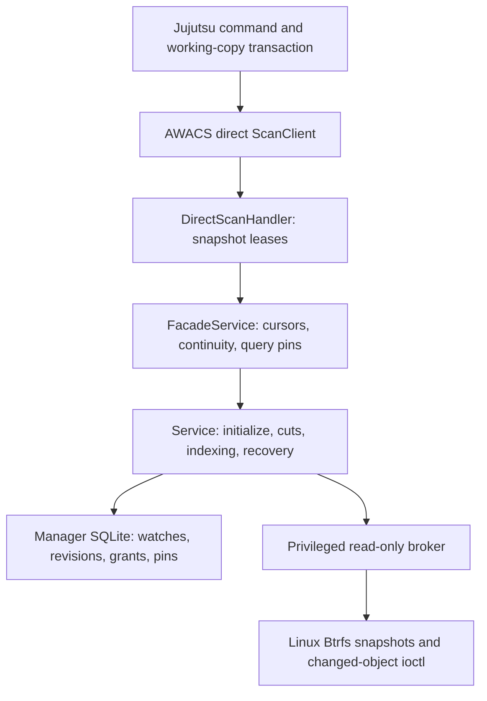

# AWACS and Jujutsu implementation specification

## 1. Purpose and status

AWACS maintains a snapshot-based change index for Btrfs subvolumes. Its
supported client boundary is the direct Jujutsu backend: Jujutsu receives an
opaque cursor, a conservative invalidation, and an open read-only snapshot
directory descriptor, then builds its working-copy tree from that immutable
snapshot.

This document describes the implementation in this repository and its companion
Jujutsu checkout at `../jj`. It distinguishes implemented mechanisms, intended
invariants, verified defects, and unsupported features. A schema table, helper
function, design proposal, or environment-gated test is not evidence that a
production path works.

### 1.1 Daemon-free architecture

Jujutsu and Git-hook callers enter through the in-process coordinator. There
is no persistent per-user daemon, scan socket, activation path, or daemon-owned
maintenance. The existing manager schema still contains richer historical
state than the steady-state target below requires; shrinking that schema is a
separate storage migration.

The AWACS library embedded by Jujutsu, and the short-lived
`git-fsmonitor-awacs` hook process, coordinate directly through one
independent state bundle per worktree:

```text
<worktree-root-parent>/.<worktree-root-name>-awacs-state/<live-subvolume-uuid>/
    manager.sqlite3
    manager.sqlite3-wal
    manager.sqlite3-shm
    path-map.sqlite3
    path-map.sqlite3-wal
    path-map.sqlite3-shm
    root.lock
    spool/
    managed/
        s-<sequence>
        quarantine/
```

The entire state bundle defaults to a private hidden sibling of the worktree.
Each root owns a small operational manager database; descendants share the
append-only immutable path-map database instead of cloning and scrubbing the
parent manager. `BTRFS_AWACS_STATE_DIR` may override that root. The managed
snapshot directory remains
private, outside the worktree, and on the same Btrfs filesystem as the
worktree. There is no per-worktree daemon socket, daemon lock, pid file, or
persistent lease directory. The privileged broker remains
as a stateless helper for bounded snapshot create/destroy and changed-object
ioctls over authenticated passed fds; it owns no watches, cursors, path maps,
or recovery state.

Each coordinator entrypoint acquires an exclusive `flock` on `root.lock`.
The simple target intentionally serializes snapshot creation, changed-object
processing, SQLite publication, returned-fd opening, and cleanup for one
worktree. SQLite transactions atomically publish logical state; Btrfs
snapshot names make external effects recoverable without a persistent
operation journal.

The target database keeps only one materialized inode/reference graph plus a
logical cut/event journal:

```text
root_state
    root_uuid
    filesystem_uuid
    epoch
    head_sequence
    replay_floor_sequence
    current_graph_hash

cuts
    sequence PRIMARY KEY
    snapshot_uuid
    graph_hash
    created_ns

current_objects
    ino PRIMARY KEY
    generation
    mode
    uid
    gid
    ...

current_refs
    parent_ino
    name
    ino

cut_events
    sequence
    ordinal
    kind
    old_path
    new_path

jj_cursor
    committed_sequence
    pending_sequence
    committed_token
    pending_token
```

`cuts` contains one row for every committed logical boundary, including a
cut with no changed paths. It records the expected UUID of the physical head
snapshot but is not a snapshot create/delete log. `cut_events` contains
normalized conservative path invalidations for one adjacent cut
(`PathAdded`, `PathRemoved`, `PathChanged`, `SubtreeMoved`, or a full
invalidation). It is not a historical path map. `current_objects` and
`current_refs` are the only materialized path/inode graph.

For committed head N, a cut proceeds as follows:

1. Verify that `s-N` exists, is read-only, and has the UUID recorded by
   `cuts(N)`.
2. Reconcile the managed directory. Delete uncommitted `s-*` orphans and
   old committed snapshots whose pathnames are no longer needed.
3. Create and verify `s-(N+1)`.
4. Compare immutable `s-N` to `s-(N+1)` through the stateless broker.
5. Use the current inode/reference graph to apply the manifest and derive
   `cut_events(N+1)`.
6. In one SQLite transaction, insert `cuts(N+1)`, insert its events,
   replace the current graph, advance `head_sequence`, and update hashes.
7. Open and verify any immutable scan-root fd that will be returned to the
   caller before releasing `root.lock`.
8. After commit, unlink older snapshot paths. Failed deletion is harmless
   and is retried by the next caller.

Sequence allocation uses the next committed sequence, not the highest filename
in the managed directory. If `s-(N+1)` exists while `cuts(N+1)` does not,
it is an uncommitted orphan from a crashed attempt: delete it and reuse
N+1. The design never deletes `s-N` before the transaction publishing
N+1 commits. If the committed head is absent or has the wrong UUID, AWACS
fails closed or requires reinitialization rather than guessing.

This ordering removes the need for durable create/delete operation rows:

```text
snapshot exists, cuts(N) absent:
    uncommitted orphan; delete and retry N

cuts(N) committed, older snapshots still exist:
    committed head is valid; retry old-path cleanup

old snapshot deletion interrupted:
    retry deletion on the next coordinator entry
```

Old cursor replay does not retain old snapshots or old path maps. At each
adjacent cut, AWACS materializes path-level `cut_events` while both endpoints
and the current graph are available. A cursor for sequence A answered at head
B unions events from A+1 through B. Jujutsu explicitly persists its committed
cursor, so event retention can preserve exactly the oldest Jujutsu sequence
that may be reused. Git fsmonitor protocol v2 does not acknowledge durable
token persistence and concurrent Git commands may reuse an older token, so
Git receives a conservative bounded event-replay window. A malformed,
cross-root, cross-epoch, or expired Git token returns a fresh token plus
`/` for full invalidation.

`awacs init` and the shared conversion helper configure colocated Git with:

```text
core.fsmonitor=/usr/local/bin/git-fsmonitor-awacs
core.fsmonitorHookVersion=2
```

The returned scan-root fd is the intended scan-lifetime retention mechanism.
After a newer head commits, an older snapshot pathname may be unlinked while
an in-flight Jujutsu scan continues through its already-open fd. All
traversal must therefore be fd-relative; callers must not reopen the managed
pathname. Real-Btrfs acceptance must prove that recursively opening and
reading descendants through an already-open snapshot-root fd still works
after the snapshot pathname is deleted. If supported kernels do not provide
that behavior, add per-snapshot shared/exclusive flock guards as a fallback;
do not restore the persistent daemon.

The steady-state storage target is:

```text
O(current repository graph)
    + O(changed paths in the retained event window)
    + O(one current snapshot plus unlinked snapshots held by open scan fds)
```

It is not O(repository size times retained cursors) and does not retain one
physical snapshot or one full path map per Git token.

AWACS requires Linux, Btrfs, an appropriate privileged broker, and the reviewed
changed-object/dirty-witness kernel support. The direct Jujutsu backend
requires a Jujutsu binary built with its optional `awacs` Cargo feature. The
ordinary Jujutsu default remains `fsmonitor.backend = "none"` and
`btrfs.enabled = false`.

## 2. Direct immutable-scan contract

Ordinary Jujutsu snapshots read files from the live working-copy directory.
The direct AWACS backend instead selects an immutable cut and returns:

- one open read-only snapshot directory fd;
- an opaque cursor for that exact logical cut;
- Full, ExactPaths, or Prefixes invalidation; and
- filesystem/subvolume identity for the opened snapshot.

Jujutsu must read relative to the retained descriptor and
must persist the new cursor only with the tree state derived from that same
snapshot. It must not reopen the managed snapshot pathname after Begin. If
descriptor identity, continuity, external inputs, or invalidation paths cannot
be proven, the client must abort or conservatively perform a full traversal.

## 3. Process topology and authority



There are three authority domains:

1. The client owns Jujutsu working-copy state.
2. The embedded coordinator opens the per-root manager database, serializes
   state transitions with root.lock, and owns the short-lived scan session.
3. The privileged broker performs bounded read-only Btrfs inspection over
   authenticated passed file descriptors.

A direct-scan request must not supply the broker's underlying authority,
manager database, managed-snapshot directory, or arbitrary commands.

## 4. Source ownership

| Component | Source | Responsibilities |
| --- | --- | --- |
| Btrfs identity and kernel calls | [`src/btrfs.rs`](src/btrfs.rs) | Open subvolume roots, inspect identity, create/destroy snapshots, and invoke changed-object interfaces. |
| Kernel stream parser | [`src/manifest.rs`](src/manifest.rs) | Parse versioned records, changed-object masks, reference changes, target attributes, and completion data. |
| Immutable namespace inspection | [`src/snapshot_walk.rs`](src/snapshot_walk.rs) | Build complete immutable indexes with ordinary userspace VFS walks. |
| Changed-object materialization | [`src/tree_index.rs`](src/tree_index.rs) | Materialize requested target objects from changed-object records. |
| Logical inode graph | [`src/index.rs`](src/index.rs) | Validate reachability, resolve hardlink aliases, apply manifests, and produce semantic path events. |
| Database bootstrap | [`src/store.rs`](src/store.rs) | Configure SQLite, extract the normative schema, migrate, and load cursor-key metadata. |
| Durable manager | [`src/manager.rs`](src/manager.rs) | Own watches, grants, snapshot pins, operation fencing, cuts, revisions, client boundaries, leases, retention, and recovery. |
| Privileged filesystem inspection | [`src/broker.rs`](src/broker.rs) | Validate expected fds/identities, execute bounded changed-object reads, and fence sessions. |
| Broker wire protocol | [`src/broker_protocol.rs`](src/broker_protocol.rs) | Authenticate broker sessions and encode fd-passing requests. |
| Core orchestration | [`src/service.rs`](src/service.rs) | Initialize watches, create cuts, stage/apply comparisons, recover effects, and expose maintenance helpers. |
| Namespace continuity | [`src/namespace.rs`](src/namespace.rs) | Bind the exact root and mount view, observe relevant topology changes, and reject continuity loss. |
| Cursor and path projection | [`src/compat.rs`](src/compat.rs) | Authenticate direct cursors and conservatively project semantic events. |
| Snapshot facade | [`src/facade.rs`](src/facade.rs) | Verify continuity, request cuts, resolve baselines, mint cursors, and manage query leases. |
| Public direct-scan API | [`src/scan.rs`](src/scan.rs) | Define Begin/Renew/Promote/Finish/ReleaseBaseline and carry one already-open snapshot fd. |
| Embedded direct coordinator | [`src/scan_facade.rs`](src/scan_facade.rs) | Bind requests to initialized roots, retain prepared responses, renew/release leases, and remember completed sessions. |
| Executable | [`src/main.rs`](src/main.rs) | Run initialization, broker, diagnostics, and the Git fsmonitor hook. |

The companion checkout adds Btrfs-backed workspace materialization and the
optional direct AWACS snapshot backend. Its relevant ownership lies in
`../jj/lib/src/fsmonitor.rs`, `../jj/lib/src/working_copy.rs`,
`../jj/lib/src/local_working_copy.rs`, `../jj/cli/src/cli_util.rs`, and the
Btrfs workspace commands.

## 5. Filesystem and namespace model

A supported root is an exact Btrfs subvolume root. Snapshot identity includes
filesystem UUID, subvolume UUID, root ID, parent/received UUID where relevant,
transaction information, read-only status, and the caller's mount/root view.
A reused pathname or replaced mount cannot substitute for the original root.

Managed snapshots live outside the watched worktree and on the same Btrfs
filesystem. Nested subvolumes and unsupported fscrypt views are outside the
supported contract.

An index contains inode objects and raw-byte parent/name references. Hardlinks
produce multiple visible names for one inode. Internal paths are
repository-relative raw bytes; direct responses use `Full` rather than a
sentinel path when a narrowed scan cannot be proven safe.

The semantic event kinds are `PathAdded`, `PathRemoved`, `PathChanged`,
`SubtreeMoved`, and `DirectoryDirtyWitness`. Directory witnesses and subtree
moves are inputs to conservative endpoint projection. A direct scan reads the
opened immutable snapshot, so live mutations after Begin cannot change the
tree being traversed.

## 6. Durable state and deployment layout

The manager database contains filesystems, watches, grants, operations,
snapshots, revisions/checkpoints/overlays, comparisons/events, client
boundaries, query/retention leases, and pins. SQLite foreign keys are enabled;
schema SQL is checked in alongside the store implementation in
[`src/store_schema.sql`](src/store_schema.sql).

The deployment layout is:

```text
<worktree-root-parent>/.<worktree-root-name>-awacs-state/<live-subvolume-uuid>/
    manager.sqlite3
    manager.sqlite3-wal
    manager.sqlite3-shm
    root.lock
    spool/
    managed/
        read-only snapshots

/run/btrfs-awacs/broker.sock
    privileged broker, unless explicitly overridden
```

`BTRFS_AWACS_MANAGED_DIR`, `BTRFS_AWACS_SPOOL_DIR`,
`BTRFS_AWACS_MANAGER_DB`, and `BTRFS_AWACS_BROKER_SOCKET` override the
corresponding paths. BTRFS_AWACS_PROBE_ROOT names a readable Btrfs subvolume
root that the privileged broker probes at startup; it refuses to listen if
the running kernel returns ENOTTY for BTRFS_IOC_CHANGED_OBJECTS. Runtime
state directories must be private.

## 7. Core lifecycle

awacs init <root> is the explicit bootstrap boundary. It converts the root to
the shared Btrfs subvolume layout, resolves and verifies the source subvolume,
reserves a watch, grant, operation, and destination, creates a read-only
snapshot, reopens and verifies that snapshot, builds a complete userspace
path/inode index, validates the graph and metadata, and publishes revision
zero. jj util subvolume enable calls the same conversion and bootstrap
helpers. Opening an uninitialized root through the direct client is an error;
a scan request never creates a watch.

Sequence zero establishes core watch identity but is not a client cursor
boundary. A later synchronized cut produces the first client-visible cursor.

For a cut, AWACS takes root.lock, creates and verifies the next snapshot,
compares immutable endpoints, stages events and overlays, validates the target,
and publishes the indexed head and client boundary in SQLite. The returned
open snapshot fd retains an in-flight scan after older snapshot pathnames are
unlinked.

Each Jujutsu workspace persists one opaque cursor. A committed scan atomically
promotes candidate B with the Jujutsu tree state; a failed scan does not
advance the cursor. ReleaseBaseline clears the direct caller's logical
baseline and triggers bounded cleanup.

Recovery reconciles fenced manager operations before retrying effects. It must
reject unmanaged lookalike snapshots, stale grants, continuity loss, and
mismatched identities. Each direct coordinator entry performs bounded lease
expiry, retained-boundary cleanup, orphan-history reclamation, and physical
garbage collection while holding the per-root lock.

## 8. Direct API and Jujutsu transaction

The embedded library exposes Begin/Renew/Promote/Finish/ReleaseBaseline.
Begin returns one fd, cursor, invalidation, identity, deadline, and session
capability. Renew extends the lease. Finish records Committed or Aborted and
releases the prepared response.

Jujutsu's direct transaction:

1. Builds ignore rules, sparse matchers, tracking policy, and a versioned
   external-input fingerprint.
2. Sends the prior AWACS cursor only when backend and fingerprint still match.
3. Validates the returned descriptor and immutable identity.
4. Traverses `/proc/self/fd/N` while retaining the fd and renewal owner.
5. Builds tree/file state from the immutable snapshot.
6. Saves tree state and matching cursor atomically.
7. Sends Finish only after the durable save succeeds.

Failure, reset, checkout, sparse mutation, or uncacheable paths abort the
pending session and clear the cursor. A failed Finish after a successful save is
cleanup failure; the saved tree/cursor pair remains the client-side result.

The supported configuration is:

```toml
[fsmonitor]
backend = "awacs"

```

Unsupported platforms or feature-disabled binaries reject awacs; a configured
direct backend fails closed when initialization, identity, or lease
verification fails.

## 9. Btrfs-backed Jujutsu workspaces

Btrfs workspace mode is independent of the direct backend:

```toml
[btrfs]
enabled = false   # true, false, or "auto"
```

Snapshot workspace creation must replace copied `.jj` identity with independent
working-copy metadata and, for colocated repositories, independent linked Git
worktree state. When the source has initialized AWACS state, creation also
copies its current path/inode graph into fresh sequence-zero child state and
cuts a child-owned s-0 immutable baseline snapshot before setup mutates the
copied metadata. The child gets a fresh SQLite store, spool, root lock,
logical cut/event history, and managed snapshot directory; it must not
reference the parent database, cursor, event history, or managed snapshot.
Optional fallback must discard snapshot-only baselines and materialize files
through the ordinary Jujutsu path.

Required safety invariants include protecting shared repository stores,
detecting dirty or replaced targets before removal, checking deletion capability
before forgetting registrations, preserving auto-mode fallback, preventing
unsupported nested subvolumes, materializing widened sparse destinations, and
cleaning linked Git worktree metadata.

## 10. Concurrency, performance, and active gaps

Cut publication is serialized per root by root.lock. Expensive filesystem work
must run outside writer transactions. Query leases retain exactly the logical
revisions and comparisons needed by an active response or scan. Direct
Begin/Renew/Finish must not hold global locks across unrelated expensive work
or blocking writes; deadlines need one coherent monotonic time base.

Current verified gaps include shared-workspace deletion hazards, fabricated
fallback baselines, unresolved companion dependency paths, invalid target
wedges, missing production retention, filesystem-wide flush cost, retained
boundary foreign-key failures, external-ignore drift, lease/deadline
disagreement, descriptor delegation risk, slow Begin
starvation, sparse workspace materialization failures, incomplete kernel
identity checks, abandoned session pins, malformed invalidation handling, and
installer friction. See [`FIXES.md`](FIXES.md) and the documentation
review pages for the stable finding IDs.

## 11. Validation and support boundary

Meaningful validation requires Linux, the supported modified Btrfs kernel,
eligible disposable Btrfs subvolumes, the privileged broker, and an
AWACS-enabled Jujutsu build. Required checks cover:

- clean builds with and without the optional AWACS feature;
- direct scans against real read-only snapshot fds;
- unlinking a managed snapshot while recursively traversing its already-open
  root fd;
- immutable scan isolation from post-Begin live mutations;
- hardlinks, directory moves, sparse state, ignores, EOL/exec policy, and
  malformed invalidations against an independent full-scan oracle;
- zero-event cuts, orphan snapshot recovery, crash after snapshot-before-
  commit, crash after commit-before-cleanup, interrupted deletion, and
  descriptor-passing isolation;
- Git protocol-v2 tokens from current, older retained, expired, malformed,
  and concurrent-token cases;
- workspace add/remove safety on Btrfs and ordinary filesystems; and
- clean/dirty latency, retained snapshots, fds, SQLite/WAL growth, event-row
  growth, and p50/p95/p99 command latency.

Until those gates pass, the support claim is limited to the reviewed
custom-kernel ABI, eligible Btrfs topology, authorized broker, direct AWACS
feature/build combination, supported path representation, and documented
configuration.

## 12. Explicit non-goals

AWACS is not a filesystem-independent watcher, a client of unmodified upstream
Btrfs kernels, a proof that recursive inotify sees every content mutation, a
proof that the retention/GC latency envelope has passed sustained
kernel-backed acceptance, or a safe reason to share mutable Jujutsu/Git state
between filesystem snapshots.

## 13. Reading guide

Start with [`src/scan.rs`](src/scan.rs), [`src/scan_facade.rs`](src/scan_facade.rs),
[`src/facade.rs`](src/facade.rs), [`src/service.rs`](src/service.rs), and
[`src/manager.rs`](src/manager.rs). Then read
`../jj/lib/src/fsmonitor.rs`, `../jj/cli/src/cli_util.rs`, and
`../jj/lib/src/local_working_copy.rs` for configuration, external inputs,
immutable traversal, pending leases, cursor persistence, and the
save-before-Finish boundary.
