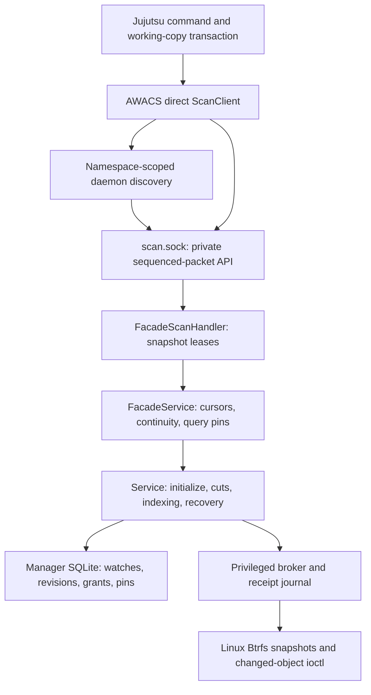

# AWACS and Jujutsu implementation specification

## 1. Purpose and status

AWACS maintains a persistent, snapshot-based change index for Btrfs
subvolumes. Its supported client boundary is the direct Jujutsu backend:
Jujutsu receives an authenticated cursor, a conservative invalidation, a
revocable lease, and an open read-only snapshot directory descriptor, then
builds its working-copy tree from that immutable snapshot.

This document describes the implementation in this repository and its companion
Jujutsu checkout at `../jj`. It distinguishes implemented mechanisms, intended
invariants, verified defects, and unsupported features. A schema table, helper
function, design proposal, or environment-gated test is not evidence that a
production path works.

AWACS requires Linux, Btrfs, an appropriate privileged broker, and the reviewed
changed-object/dirty-witness kernel support. The direct Jujutsu backend
requires a Jujutsu binary built with its optional `awacs` Cargo feature. The
ordinary Jujutsu default remains `fsmonitor.backend = "none"` and
`btrfs.enabled = false`.

## 2. Direct immutable-scan contract

Ordinary Jujutsu snapshots read files from the live working-copy directory.
The direct AWACS backend instead selects an immutable cut and returns:

- one pinned read-only snapshot directory fd;
- an opaque authenticated cursor for that exact cut;
- `Full`, `ExactPaths`, or `Prefixes` invalidation;
- filesystem/subvolume identity and a monotonic lease deadline; and
- a private capability used only for Renew and Finish.

Jujutsu must read through `/proc/self/fd/N` while retaining the descriptor and
must persist the new cursor only with the tree state derived from that same
snapshot. If descriptor identity, continuity, cursor ownership, external
inputs, invalidation paths, or lease renewal cannot be proven, the client must
abort or conservatively perform a full traversal.

## 3. Process topology and authority



There are three authority domains:

1. The client owns Jujutsu working-copy state.
2. The per-user namespace daemon owns watches, scan sessions, continuity
   monitors, and the manager database connection.
3. The privileged broker performs constrained Btrfs operations and keeps a
   separate receipt journal for replayable filesystem effects.

A direct-scan request must not supply the broker's underlying authority,
manager database, managed-snapshot directory, or arbitrary commands.

## 4. Source ownership

| Component | Source | Responsibilities |
| --- | --- | --- |
| Btrfs identity and kernel calls | [`src/btrfs.rs`](src/btrfs.rs) | Open subvolume roots, inspect identity, create/destroy snapshots, and invoke changed-object interfaces. |
| Kernel stream parser | [`src/manifest.rs`](src/manifest.rs) | Parse versioned records, changed-object masks, reference changes, target attributes, and completion data. |
| Immutable namespace inspection | [`src/tree_index.rs`](src/tree_index.rs) | Build complete immutable indexes or materialize requested target objects. |
| Logical inode graph | [`src/index.rs`](src/index.rs) | Validate reachability, resolve hardlink aliases, apply manifests, and produce semantic path events. |
| Database bootstrap | [`src/store.rs`](src/store.rs) | Configure SQLite, extract the normative schema, migrate, and load cursor-key metadata. |
| Durable manager | [`src/manager.rs`](src/manager.rs) | Own watches, grants, snapshot pins, operation fencing, cuts, revisions, client boundaries, leases, retention, and recovery. |
| Privileged filesystem execution | [`src/broker.rs`](src/broker.rs) | Validate expected fds/identities, execute constrained filesystem effects, fence sessions, and persist receipts. |
| Broker wire protocol | [`src/broker_protocol.rs`](src/broker_protocol.rs) | Authenticate broker sessions and encode fd-passing requests. |
| Core orchestration | [`src/service.rs`](src/service.rs) | Initialize watches, create cuts, stage/apply comparisons, recover effects, and expose maintenance helpers. |
| Namespace continuity | [`src/namespace.rs`](src/namespace.rs) | Bind the exact root and mount view, observe relevant topology changes, and reject continuity loss. |
| Optional precision journal | [`src/precision.rs`](src/precision.rs) | Record exact mutation hints or mark an epoch gapped. |
| Cursor and path projection | [`src/compat.rs`](src/compat.rs) | Authenticate direct cursors and conservatively project semantic events. |
| Snapshot facade | [`src/facade.rs`](src/facade.rs) | Verify continuity, request cuts, resolve baselines, mint cursors, and manage query leases. |
| Public direct-scan API | [`src/scan.rs`](src/scan.rs) | Define Begin/Renew/Finish, discover the scan socket, and transfer one snapshot fd. |
| Direct-scan daemon bridge | [`src/scan_facade.rs`](src/scan_facade.rs) | Bind requests to roots, retain prepared responses, renew/release leases, and remember completed sessions. |
| Executable and activation | [`src/main.rs`](src/main.rs) | Start/discover the namespace daemon, configure paths, publish the scan socket, authenticate clients, and dispatch connections. |

The companion checkout adds Btrfs-backed workspace materialization and the
optional direct AWACS snapshot backend. Its relevant ownership lies in
`../jj/lib/src/fsmonitor.rs`, `../jj/lib/src/working_copy.rs`,
`../jj/lib/src/local_working_copy.rs`, `../jj/cli/src/cli_util.rs`, and the
Btrfs workspace commands.

## 5. Filesystem and namespace model

A supported root is an exact Btrfs subvolume root. Snapshot identity includes
filesystem UUID, subvolume UUID, root ID, parent/received UUID where relevant,
transaction information, read-only status, and the caller's mount/root view.
A reused pathname or replaced mount cannot substitute for the original root.

Managed snapshots live outside the watched worktree and on the same Btrfs
filesystem. Nested subvolumes and unsupported fscrypt views are outside the
supported contract.

An index contains inode objects and raw-byte parent/name references. Hardlinks
produce multiple visible names for one inode. Internal paths are
repository-relative raw bytes; direct responses use `Full` rather than a
sentinel path when a narrowed scan cannot be proven safe.

The semantic event kinds are `PathAdded`, `PathRemoved`, `PathChanged`,
`SubtreeMoved`, and `DirectoryDirtyWitness`. Directory witnesses and subtree
moves are inputs to conservative endpoint projection. A direct scan reads the
leased immutable snapshot, so live mutations after Begin cannot change the
tree being traversed.

## 6. Durable state and deployment layout

The manager database contains filesystems, watches, grants, operations,
snapshots, revisions/checkpoints/overlays, comparisons/events, client
boundaries, query/retention leases, and pins. The privileged broker uses a
separate receipt database. SQLite foreign keys are enabled; schema SQL is
extracted from fenced blocks in
[`docs/indexed-change-tracking.md`](docs/indexed-change-tracking.md).

The deployment layout is:

```text
${XDG_RUNTIME_DIR}/btrfs-awacs/mnt-<device>-<inode>/
    daemon.lock
    scan.sock

${XDG_STATE_HOME:-$HOME/.local/state}/btrfs-awacs/
    <manager database>
    spool/

<watch-root-parent>/.btrfs-awacs-managed/
    managed read-only snapshots

/run/btrfs-awacs/broker.sock
    privileged broker, unless explicitly overridden
```

`BTRFS_AWACS_MANAGED_DIR`, `BTRFS_AWACS_SPOOL_DIR`,
`BTRFS_AWACS_MANAGER_DB`, and `BTRFS_AWACS_BROKER_SOCKET` override the
corresponding paths. Runtime directories must be private and client sockets
mode `0600`.

## 7. Core lifecycle

Initialization resolves and verifies the source subvolume, reserves a watch,
grant, operation, and destination, asks the broker for a read-only snapshot,
reopens and verifies that snapshot, builds a complete immutable index, validates
the graph and metadata, publishes revision zero, and arms mandatory
root/mount-continuity monitors.

Sequence zero establishes core watch identity but is not a client cursor
boundary. A later synchronized cut produces the first client-visible cursor.

For a cut, AWACS reserves a sequence, creates and verifies a new snapshot,
compares immutable endpoints, stages events and overlays, validates the target,
publishes the indexed head and client boundary, then keeps required snapshots
pinned until every active lease releases them.

Recovery reconciles broker receipts and fenced manager operations before
retrying effects. It must reject unmanaged lookalike snapshots, stale grants,
continuity loss, and mismatched identities. A periodic production worker runs
bounded lease expiry, retained-boundary cleanup, orphan-history reclamation,
and receipt-fenced physical garbage collection on a separate manager handle.

## 8. Direct API and Jujutsu transaction

The private transport uses Unix `SOCK_SEQPACKET` at `scan.sock`. Begin returns
one fd, cursor, invalidation, identity, deadline, and session capability.
Renew extends the durable lease. Finish records `Committed` or `Aborted` and
releases the pinned response.

Jujutsu's direct transaction:

1. Builds ignore rules, sparse matchers, tracking policy, and a versioned
   external-input fingerprint.
2. Sends the prior AWACS cursor only when backend and fingerprint still match.
3. Validates the returned descriptor and immutable identity.
4. Traverses `/proc/self/fd/N` while retaining the fd and renewal owner.
5. Builds tree/file state from the immutable snapshot.
6. Saves tree state and matching cursor atomically.
7. Sends Finish only after the durable save succeeds.

Failure, reset, checkout, sparse mutation, or uncacheable paths abort the
pending session and clear the cursor. A failed Finish after a successful save is
cleanup failure; the saved tree/cursor pair remains the client-side result.

The supported configuration is:

```toml
[fsmonitor]
backend = "awacs"

[fsmonitor.awacs]
socket = ""
```

An explicit absolute socket path may be supplied. Unsupported platforms or
feature-disabled binaries reject `awacs`; a configured direct backend fails
closed when discovery, connection, identity, or lease verification fails.

## 9. Btrfs-backed Jujutsu workspaces

Btrfs workspace mode is independent of the direct backend:

```toml
[btrfs]
enabled = false   # true, false, or "auto"
```

Snapshot workspace creation must replace copied `.jj` identity with independent
working-copy metadata and, for colocated repositories, independent linked Git
worktree state. Optional fallback must discard snapshot-only baselines and
materialize files through the ordinary Jujutsu path.

Required safety invariants include protecting shared repository stores,
detecting dirty or replaced targets before removal, checking deletion capability
before forgetting registrations, preserving auto-mode fallback, preventing
unsupported nested subvolumes, materializing widened sparse destinations, and
cleaning linked Git worktree metadata.

## 10. Concurrency, performance, and active gaps

Cut publication is writer-serialized per watch. Expensive filesystem work must
run outside writer transactions. Query leases retain exactly the snapshots,
revisions, and comparisons needed by an active response or scan. Direct
Begin/Renew/Finish must not hold global locks across unrelated expensive work
or blocking writes; deadlines need one coherent monotonic time base.

Current verified gaps include shared-workspace deletion hazards, fabricated
fallback baselines, unresolved companion dependency paths, invalid target
wedges, missing production retention, filesystem-wide flush cost, retained
boundary foreign-key failures, external-ignore drift, lease/deadline
disagreement, descriptor delegation risk, slow Begin
starvation, sparse workspace materialization failures, incomplete kernel
identity checks, abandoned session pins, malformed invalidation handling, and
installer/discovery friction. See [`FIXES.md`](FIXES.md) and the documentation
review pages for the stable finding IDs.

## 11. Validation and support boundary

Meaningful validation requires Linux, the supported modified Btrfs kernel,
eligible disposable Btrfs subvolumes, the privileged broker, and an
AWACS-enabled Jujutsu build. Required checks cover:

- clean builds with and without the optional AWACS feature;
- direct Begin/Renew/Finish against real read-only snapshot fds;
- immutable scan isolation from post-Begin live mutations;
- hardlinks, directory moves, sparse state, ignores, EOL/exec policy, and
  malformed invalidations against an independent full-scan oracle;
- crash/restart, receipt replay, exact baseline retention, lease expiry, and
  descriptor-passing isolation;
- workspace add/remove safety on Btrfs and ordinary filesystems; and
- clean/dirty latency, retained snapshots, fds, threads, session count,
  SQLite/WAL growth, and p50/p95/p99 command latency.

Until those gates pass, the support claim is limited to the reviewed
custom-kernel ABI, eligible Btrfs topology, authorized broker, direct AWACS
feature/build combination, supported path representation, and documented
configuration.

## 12. Explicit non-goals

AWACS is not a filesystem-independent watcher, a client of unmodified upstream
Btrfs kernels, a proof that recursive inotify sees every content mutation, a
proof that the retention/GC latency envelope has passed sustained
kernel-backed acceptance, or a safe reason to share mutable Jujutsu/Git state
between filesystem snapshots.

## 13. Reading guide

Start with [`src/scan.rs`](src/scan.rs), [`src/scan_facade.rs`](src/scan_facade.rs),
[`src/facade.rs`](src/facade.rs), [`src/service.rs`](src/service.rs), and
[`src/manager.rs`](src/manager.rs). Then read
`../jj/lib/src/fsmonitor.rs`, `../jj/cli/src/cli_util.rs`, and
`../jj/lib/src/local_working_copy.rs` for configuration, external inputs,
immutable traversal, pending leases, cursor persistence, and the
save-before-Finish boundary.
