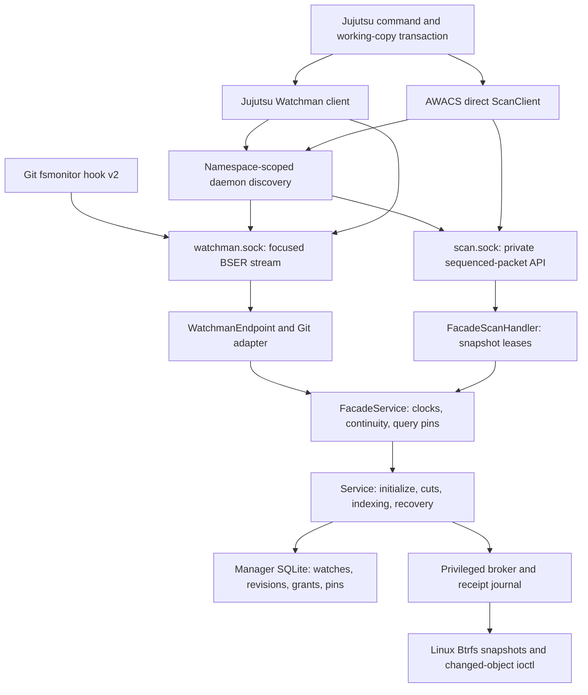
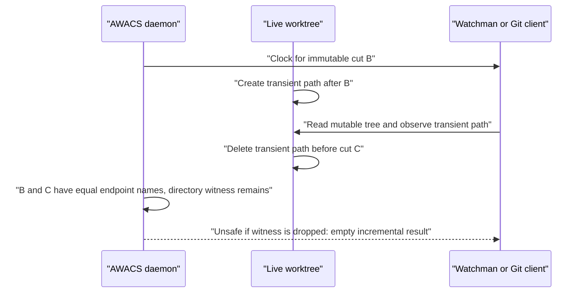
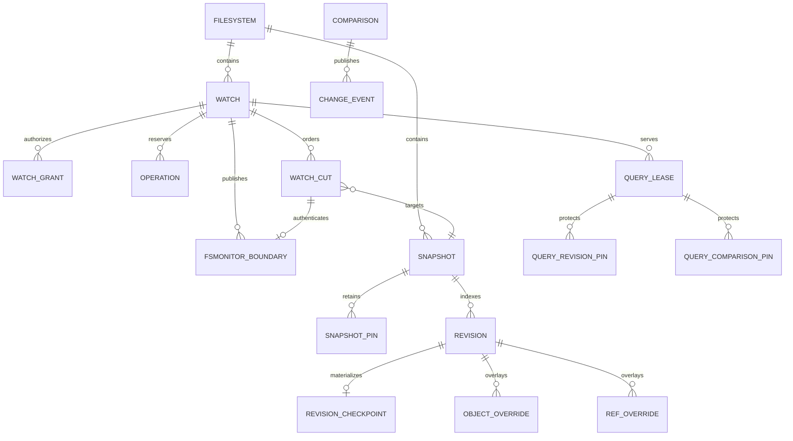
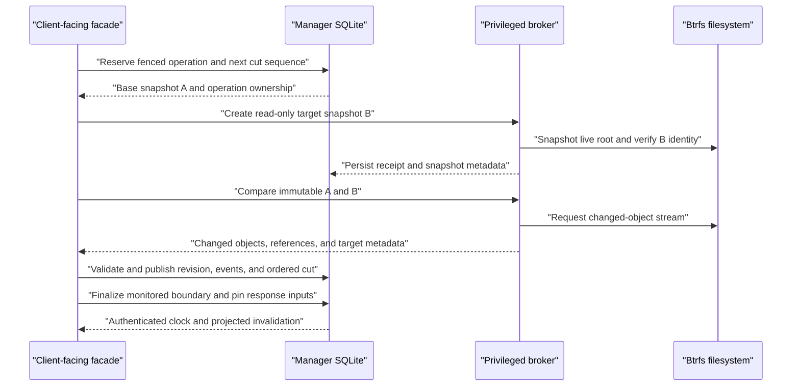
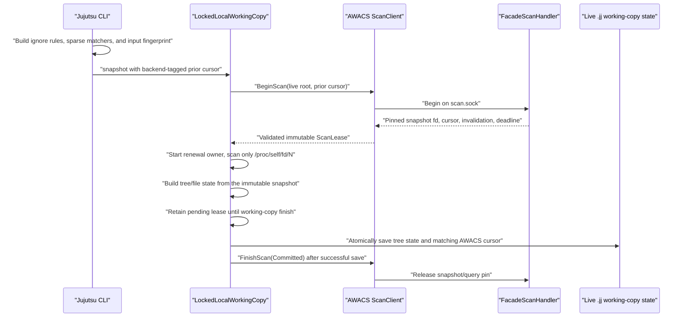
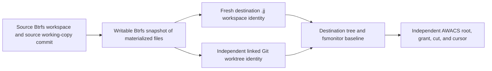

# AWACS and Jujutsu implementation specification

## 1. Purpose and status

AWACS maintains a persistent, snapshot-based change index for Btrfs
subvolumes. Its clients can ask which repository paths changed between
authenticated immutable filesystem cuts. Jujutsu can additionally lease the
actual read-only snapshot and build its working-copy tree from that snapshot
instead of racing a mutable checkout.

This document describes the **implementation that currently exists** in this
repository and its companion Jujutsu checkout at `../jj`. It distinguishes
implemented mechanisms, intended invariants, verified defects, and unsupported
features. It does not treat a schema table, a helper function, a design
proposal, or an environment-gated test as proof that a production path works.

The older [indexed change-tracking design](docs/indexed-change-tracking.md)
contains the normative Btrfs/index/database design and SQL schema. The companion
[Jujutsu scan design](../jj/docs/design/awacs-snapshot-scans.md) describes the
direct-scan integration. [FIXES.md](FIXES.md) records an earlier audit, but some
of its findings have since been fixed; the current verified issues are in
[Section 21](#21-verified-implementation-gaps-and-review-findings).

AWACS requires Linux, Btrfs, an appropriate privileged broker, and the
experimental Btrfs changed-object/dirty-witness kernel support. The direct
Jujutsu backend additionally requires a Jujutsu binary built with its optional
`awacs` Cargo feature. The ordinary Jujutsu default remains
`fsmonitor.backend = "none"` and `btrfs.enabled = false`.

## 2. The problem and the two different answers

Ordinary Jujutsu snapshots read files from the live working-copy directory.
Without a monitor, Jujutsu traverses the selected repository paths. With
Watchman, it requests changed paths and a clock, narrows the traversal, and
still reads the live directory.

AWACS offers two materially different integrations:

| Integration | What the client receives | Where Jujutsu/Git reads files | Main correctness obligation |
| --- | --- | --- | --- |
| Focused Watchman compatibility | Changed names and an authenticated clock | Mutable live checkout | Report every path the client might have cached after its previous clock, including transient namespace changes. |
| Native Git hook v2 | An authenticated token and NUL-delimited changed names | Mutable live checkout/index refresh | Conservatively invalidate Git's tracked/untracked/index state, including directory and transient changes. |
| Direct Jujutsu backend | A pinned read-only snapshot directory fd, authenticated cursor, invalidation, and lease | Immutable snapshot via `/proc/self/fd/N` | Read one exact immutable snapshot; persist its cursor only with the tree state derived from that same snapshot. |

The direct backend is **not** an alternate encoding of the Watchman protocol.
Its immutable scan root eliminates a class of live-crawl races, but introduces
descriptor identity, lease lifetime, transaction, and external-input
fingerprint requirements.

## 3. Process and component topology



There are three authority domains:

1. **The client** owns the Jujutsu working-copy state or Git index.
2. **The per-user namespace daemon** owns watches, projections, scan sessions,
   continuity monitors, and the manager database connection.
3. **The privileged broker** performs constrained Btrfs operations and keeps a
   separate receipt journal for replayable filesystem effects.

Neither a Watchman request nor a direct-scan request is allowed to supply the
broker's underlying authority, manager database, managed-snapshot directory, or
arbitrary commands.

## 4. AWACS source ownership

| Component | Source | Responsibilities |
| --- | --- | --- |
| Btrfs identity and kernel calls | [`src/btrfs.rs`](src/btrfs.rs) | Open subvolume roots, inspect filesystem/subvolume UUIDs and generation, create/destroy snapshots, and invoke legacy/v2 changed-object interfaces. |
| Kernel stream parser | [`src/manifest.rs`](src/manifest.rs) | Parse versioned records, changed-object masks, hardlink/reference changes, target attributes, nested-subvolume transitions, and completion data. |
| Immutable namespace inspection | [`src/tree_index.rs`](src/tree_index.rs) | Read a complete immutable inode/reference index or materialize requested target objects and security metadata. |
| Logical inode graph | [`src/index.rs`](src/index.rs) | Represent objects and reference edges, validate reachability, resolve all hardlink aliases, apply manifests, and produce semantic path events. |
| Database bootstrap | [`src/store.rs`](src/store.rs) | Create/open manager and broker SQLite databases, configure WAL/foreign keys, extract the normative SQL schema from the design document, migrate, and load clock-key metadata. |
| Durable manager | [`src/manager.rs`](src/manager.rs) | Own watches, grants, snapshot identities/pins, operation fencing, cut admission, revisions/checkpoints/overlays, client boundaries, query leases, retention, and recovery transitions. |
| Privileged filesystem execution | [`src/broker.rs`](src/broker.rs) | Validate expected fds/identities, execute constrained filesystem effects, fence sessions, and persist root-owned operation receipts. |
| Broker wire protocol | [`src/broker_protocol.rs`](src/broker_protocol.rs) | Authenticate broker sessions and encode fd-passing requests for snapshot creation/deletion, full indexing, target lookup, and changed-object comparison. |
| Core orchestration | [`src/service.rs`](src/service.rs) | Initialize a watch, adopt an existing snapshot descendant, create cuts, stage/apply comparisons, recover unfinished effects, and expose maintenance helpers. |
| Mandatory namespace continuity | [`src/namespace.rs`](src/namespace.rs) | Bind the exact root and mount view, watch ancestor/root-path identity, observe mount-topology changes, and reject ABA/continuity loss. |
| Optional precision journal | [`src/precision.rs`](src/precision.rs) | Recursively watch directories with inotify, certify ordered marker-delimited intervals, and persist exact mutation hints or mark an epoch gapped. |
| Clock and path compatibility | [`src/compat.rs`](src/compat.rs) | Authenticate opaque Watchman clocks and domain-separated direct cursors, project semantic events, and provide the presently unused precision-aware range projector. |
| Client-visible snapshot facade | [`src/facade.rs`](src/facade.rs) | Activate a monitored view, verify continuity, request cuts, resolve exact historical baselines, mint clocks, pin response inputs, and release/renew query leases. |
| BSER codec | [`src/bser.rs`](src/bser.rs) | Bound and encode/decode the small BSER-v2 value subset used by the Watchman endpoint. |
| Watchman semantics | [`src/watchman.rs`](src/watchman.rs) | Register roots, dynamically adopt/initialize compatible roots, implement `watch-project`, `clock`, restricted `query`, and compatibility-only `trigger-del`. |
| Watchman transport | [`src/watchman_transport.rs`](src/watchman_transport.rs) | Frame Unix-stream BSER requests, inspect connected-peer identity, authorize namespace/root access, and bound response writes. |
| Git integration | [`src/git_fsmonitor.rs`](src/git_fsmonitor.rs) | Validate hook protocol v2, issue focused Watchman registration/query requests, exclude `.git`, and produce NUL-framed Git responses. |
| Public direct-scan API | [`src/scan.rs`](src/scan.rs) | Define request/result/error traits, discover the scan socket, authenticate private packet framing, pass one snapshot fd with `SCM_RIGHTS`, and issue Begin/Renew/Finish requests. |
| Direct-scan daemon bridge | [`src/scan_facade.rs`](src/scan_facade.rs) | Bind requests to a live root, retain pinned prepared responses in an active-session registry, convert projections, renew/release leases, and remember completed session IDs. |
| Executable and activation | [`src/main.rs`](src/main.rs) | Provide multicall CLI entry points, start/discover the namespace daemon, configure broker/state/snapshot paths, publish both sockets, authenticate clients, and dispatch connections. |

[`src/trigger.rs`](src/trigger.rs) is dormant scaffolding: it is not exported by
[`src/lib.rs`](src/lib.rs), and its presence does not imply functioning
Watchman trigger execution.

## 5. Jujutsu source ownership

The corresponding checkout contains two related but distinct additions:
Btrfs-backed workspace materialization and the direct AWACS snapshot backend.

| Component | Source | Responsibilities |
| --- | --- | --- |
| Optional dependency and feature | [`../jj/Cargo.toml`](../jj/Cargo.toml), [`../jj/lib/Cargo.toml`](../jj/lib/Cargo.toml), [`../jj/cli/Cargo.toml`](../jj/cli/Cargo.toml) | Declare `btrfs-awacs`, expose `jj-lib/awacs`, and expose the CLI's nondefault `awacs` feature. |
| Monitor settings and fingerprint | [`../jj/lib/src/fsmonitor.rs`](../jj/lib/src/fsmonitor.rs) | Parse `none`, `watchman`, and `awacs`; represent the AWACS socket/client; compute versioned, canonical SHA-256 external-input fingerprints. |
| Public snapshot options | [`../jj/lib/src/working_copy.rs`](../jj/lib/src/working_copy.rs) | Carry ignore sources, sparse/tracking matchers, size limits, and the optional AWACS fingerprint into a working-copy snapshot. |
| Persisted monitor cursors | [`../jj/lib/src/protos/local_working_copy.proto`](../jj/lib/src/protos/local_working_copy.proto) | Store a backend-tagged `FsmonitorCursor`; preserve a deprecated legacy Watchman field for reading older state. |
| Working-copy scan and transaction | [`../jj/lib/src/local_working_copy.rs`](../jj/lib/src/local_working_copy.rs) | Choose the live or immutable scan root, translate invalidations into matchers, traverse/read files, validate descriptors, renew scan leases, and save cursor/tree state transactionally. |
| CLI snapshot preparation | [`../jj/cli/src/cli_util.rs`](../jj/cli/src/cli_util.rs) | Assemble Git/Jujutsu ignore rules, sparse state, tracking policy, effective executable/EOL policy, and AWACS fingerprint before command snapshotting. |
| Btrfs detection and operations | [`../jj/cli/src/commands/btrfs.rs`](../jj/cli/src/commands/btrfs.rs) | Inspect Btrfs paths/subvolume roots, invoke the `btrfs` CLI, and identify mount options relevant to unprivileged deletion. |
| Btrfs-backed workspace creation | [`../jj/cli/src/commands/workspace/add.rs`](../jj/cli/src/commands/workspace/add.rs) | Optionally snapshot the source checkout, replace copied `.jj` identity, create an independent linked Git worktree, and establish the new workspace baseline. |
| Workspace removal | [`../jj/cli/src/commands/workspace/remove.rs`](../jj/cli/src/commands/workspace/remove.rs) | Forget the workspace, then remove a Btrfs subvolume or ordinary directory according to configuration. |
| Subvolume-backed cloning | [`../jj/cli/src/commands/git/clone.rs`](../jj/cli/src/commands/git/clone.rs) | Optionally create a new clone destination as a Btrfs subvolume. |

The direct backend must be optional and must not alter existing `none` or
ordinary Watchman behavior. Several current deviations from that requirement
are documented below.

## 6. Filesystem and namespace model

### 6.1 Snapshot identity

A supported watch root is an exact Btrfs subvolume root. Its root inode is 256;
an arbitrary directory inside a subvolume is insufficient. Snapshot identity
includes the filesystem UUID, subvolume UUID, Btrfs root ID, parent/received
UUID where relevant, transaction information, and the read-only flag.

The identity that matters is not just a pathname. A reused pathname, different
subvolume with the same inode number, snapshot from another filesystem, or
changed namespace cannot safely substitute for the original root.

Managed snapshots live **outside** the watched worktree and on the same Btrfs
filesystem. Placing them inside the worktree would mutate the indexed namespace
and introduce nested-subvolume boundaries. Nested subvolumes and unsupported
fscrypt views are outside the supported watch contract.

### 6.2 Objects, references, and raw paths

An `Index` consists of:

```text
objects:    inode -> generation, mode, owner, link count, privilege metadata
references: (child inode, parent inode, raw component name)
```

Directories have one parent reference; files may have multiple references
because hardlinks represent multiple visible names for one object. A path is
derived by walking references back to inode 256. Internal paths are
**repository-relative raw bytes**, such as `src/file.rs`; they do not have a
leading slash. `/` is reserved as a full-invalidation sentinel in the
compatibility projection.

The semantic event kinds are `PathAdded`, `PathRemoved`, `PathChanged`,
`SubtreeMoved`, and `DirectoryDirtyWitness`. A directory rename changes every
descendant pathname even if the kernel reports a compact parent/reference
change. A surviving directory witness records that a subtree may have undergone
changes whose intermediate names no longer exist at the final endpoint.

### 6.3 The dirty-witness distinction

The custom kernel contract is intended to ensure that a post-snapshot
client-visible mutation changes either an emitted object or a surviving
ancestor's directory inode. This guarantee is essential for **live**
Watchman/Git scans, because a client can observe a transient name after it
received an older clock.

A **direct immutable scan** reads the exact leased snapshot instead. If a file
appears and disappears in the live root while the client scans that snapshot,
the client cannot accidentally cache that transient file from the immutable
root. The direct client still needs accurate endpoint changes, aliases,
directory-move coverage, authenticated continuity, and matching external
inputs.



The corresponding direct client reads immutable B, not `Live`, so this exact
transient-observation failure does not apply to direct snapshot traversal.

## 7. Durable stores and persisted relationships

The manager database contains service metadata, an HMAC key, filesystems,
snapshots, revisions/checkpoints/overlays, comparisons and events, watches,
grants, operations, cut admissions, cut rows, client-visible boundaries,
query/retention leases, and snapshot pins. The privileged broker uses a
separate receipt database.



Key distinctions:

- A **physical cut head** records the newest managed read-only snapshot.
- An **indexed head** records the newest snapshot whose immutable namespace
  comparison has been validated and published.
- A **revision** describes one immutable inode/reference graph. Initial
  revisions can be complete checkpoints; subsequent revisions can be overlays.
- A **cut** orders snapshot transitions for one watch.
- A **filesystem-monitor boundary** authorizes a particular published cut,
  clock epoch, grant, monitor session, and target snapshot.
- A **pin** prevents physical snapshot reclamation while a head, operation,
  comparison, response, scan, or explicit retention lease requires it.
- A **broker receipt** persists the intent and outcome of a privileged
  filesystem mutation independently from the manager transaction.

SQLite foreign keys are enabled. Schema SQL is extracted from fenced blocks in
[`docs/indexed-change-tracking.md`](docs/indexed-change-tracking.md), so that
document is part of the executable schema input rather than merely explanatory
documentation.

### 7.1 Automatic deployment layout

The current automatic activation uses:

```text
${XDG_RUNTIME_DIR}/btrfs-awacs/mnt-<device>-<inode>/
    daemon.lock
    watchman.sock
    scan.sock

${XDG_STATE_HOME:-$HOME/.local/state}/btrfs-awacs/
    watchman.sqlite3
    spool/

<watch-root-parent>/.btrfs-awacs-managed/
    managed read-only snapshots

/run/btrfs-awacs/broker.sock
    privileged broker, unless explicitly overridden
```

`BTRFS_AWACS_MANAGED_DIR`, `BTRFS_AWACS_SPOOL_DIR`,
`BTRFS_AWACS_MANAGER_DB`, and `BTRFS_AWACS_BROKER_SOCKET` override the
corresponding paths. Runtime directories must be private; public per-user
sockets are mode `0600`. The managed snapshot directory must stay on the same
Btrfs filesystem as its source root.

## 8. Privileged broker and fencing

The broker receives a constrained `SOCK_SEQPACKET` protocol rather than shell
commands. Its fixed operations include:

- Session handshake and manager identity fencing.
- Filesystem/subvolume inspection.
- Read-only snapshot creation and managed snapshot deletion.
- Complete immutable index construction and target-object lookup.
- Changed-object comparison of two verified immutable snapshots.
- Receipt inspection and reconciliation after interrupted operations.

Requests carry already-open fds and expected filesystem/subvolume identities.
The broker verifies source UUIDs, target locators, read-only flags, output-file
properties, and manager session ownership. Snapshot creation and deletion use
durable receipts because a Btrfs mutation and a SQLite commit cannot form one
atomic transaction.

The intended effect ordering is:

```text
persist fenced intent
    -> run one authorized filesystem effect
    -> verify its exact resulting identity
    -> make the effect sufficiently durable
    -> persist its receipt
    -> allow the manager to publish the result
```

The present implementation uses filesystem-wide `syncfs` for that durability
step; the performance consequences are described below.

## 9. Core lifecycle: initializing a watch

The first registration of an unindexed root proceeds as follows:

1. Resolve and verify the exact Btrfs subvolume root and its filesystem.
2. Authorize the requesting UID/GID and reserve a watch, grant, fenced
   operation, and deterministic managed snapshot destination.
3. Ask the broker to create a read-only snapshot of the live root.
4. Reopen the snapshot and verify filesystem UUID, subvolume UUID, parent
   identity, read-only status, and expected destination.
5. Build a complete index from the immutable snapshot, not from the changing
   live root.
6. Validate graph connectivity, aliases, ownership/security metadata, supported
   boundaries, and canonical checkpoint data.
7. Publish revision zero, independent indexed-head and physical-head pins, the
   active watch, and its initial grant.
8. Arm the mandatory root-path and mount-topology monitors before exposing any
   client clock.

Sequence zero initializes the **core watch**. It is not, by itself, a
Watchman/direct-scan clock boundary. The first client-visible clock is created
by a subsequent synchronized cut and facade finalization.

An already-created Btrfs snapshot descendant can sometimes adopt a retained
parent revision. This reuses index data but still creates an independent watch,
grant, identity, and eventual client boundary. It does not make two Jujutsu
workspaces share mutable `.jj` or `.git` state.

## 10. Core lifecycle: taking and publishing a cut



The durable operation progresses through states equivalent to:

```text
planned
    -> fs_started
    -> fs_created / uuid_recorded
    -> manifest_ready
    -> index_committed
    -> done
```

The changed-object stream identifies created/deleted/replaced objects,
reference additions/removals, inode metadata, file-content/xattr changes,
nested-boundary transitions, and directory witnesses. Applying a manifest must
resolve old paths against snapshot A and new paths/all hardlink aliases against
snapshot B.

Snapshots are cut in sequence for a watch; comparison/indexing should not
publish a later indexed head before its predecessor is valid. A fallback
full-fresh checkpoint is needed when incremental continuity or the kernel ABI
cannot support the requested delta. A client must receive an explicit full
invalidation for such a checkpoint, not a partially valid incremental result.

**Current caveat:** the implementation advances the physical head before some
immutable target validations complete. An unsupported nested subvolume or
fscrypt entry can therefore leave an unrecoverable invalid target as the
physical head; see finding C-05.

## 11. Recovery, retention, and client continuity

Crash recovery must reconcile broker receipts and fenced manager operations
before retrying filesystem effects. A snapshot path may be adopted only when
its expected UUID, source, parent, flags, and durable intent agree. Stale spool
artifacts and unmanaged lookalike snapshots must not be silently trusted.

Facade continuity is separate from snapshot identity:

- The root-path monitor watches every relevant ancestor/component.
- The mount monitor retains and polls `/proc/self/mountinfo`.
- Root replacement, rename/restore, mount-over, monitor loss, grant revocation,
  or epoch/session replacement invalidate existing clocks.
- The optional recursive precision guard is a separate optimization. Its
  overflow or absence must not weaken the mandatory root/mount monitors.

Opaque clocks are HMAC-authenticated capabilities. Their claims identify the
store, watch, clock epoch, owner grant, monitor session, exact cut sequence,
boundary kind, algorithm version, and target snapshot UUID. A direct cursor
wraps the same clock in a separate authenticated domain, preventing accidental
interchange between direct and Watchman cursors.

Historical replay currently verifies the **exact retained cut sequence and
snapshot UUID**. The older claim in [FIXES.md](FIXES.md) that replay accepts an
older `<=` boundary no longer describes this checkout.

The implementation contains physical garbage-collection, history-retention,
compaction, deletion-fencing, and lease-expiration helpers. However, the daemon
does not schedule the production maintenance path, and the existing compaction
cleanup violates retained-boundary foreign keys. Those features must therefore
be described as incomplete, not as enforced retention.

## 12. Watchman compatibility path

The supported configuration is:

```toml
[fsmonitor]
backend = "watchman"

[fsmonitor.watchman]
register-snapshot-trigger = false
```

The AWACS multicall `watchman` entry point supports discovery. The namespace
daemon publishes `watchman.sock`, and Jujutsu's existing `watchman_client`
connects through the normal Watchman client path.

The intentionally limited command set is:

1. `watch-project(ROOT)`: validate or dynamically register/adopt an exact root.
2. `query(ROOT, OPTIONS)`: create a synchronized cut, resolve the prior clock,
   project changed names, apply a restricted expression, and return a new clock.
3. `clock(ROOT, OPTIONS)`: publish a synchronized clock without returning a
   changed-name list.
4. Fixed `trigger-del`: currently return a compatibility-only synthetic
   `deleted: false` response.

Queries are limited to the fields and expressions expected by the reviewed
Jujutsu/Git clients. This is not a general Watchman server. `trigger`,
`trigger-list`, subscriptions, SCM clocks, arbitrary expressions, and
background-trigger execution are unsupported.

On an ordinary Watchman failure, Jujutsu can warn and fall back to a live full
scan without trusting an unproved monitor clock. That fallback is distinct
from the direct AWACS backend's fail-closed behavior.

The facade allocates a `PreparedQueryResult`, pins the relevant immutable
inputs, and is expected to release its query lease only after response
serialization/writing finishes. Error paths after response allocation need the
same release guarantee.

## 13. Native Git fsmonitor path

Git invokes the multicall `git-fsmonitor-hook` executable with:

```text
git-fsmonitor-hook 2 OLD_TOKEN
```

The hook connects to `watchman.sock`, sends `watch-project` for the Git
worktree, then sends a restricted Watchman `query`. It translates the response
into Git's native hook-v2 framing:

```text
NEW_TOKEN NUL CHANGED_PATH NUL CHANGED_PATH NUL ...
```

An empty, numeric, unknown, or foreign token requires a fresh/full
invalidation. `.git` paths are excluded. The current Git adapter is "native"
at the client protocol boundary, but internally still depends on the focused
Watchman socket; it is not an independent single-request Git daemon protocol.

Unlike the direct scan socket, the existing Git socket wrapper sets bounded
read/write deadlines.

## 14. Direct immutable-snapshot API

### 14.1 Public request/result contract

[`src/scan.rs`](src/scan.rs) exposes the transport-independent API consumed by
Jujutsu:

```text
BeginScanRequest {
    live_root: absolute live working-copy path,
    previous_cursor: optional opaque authenticated cursor,
}

ScanLease {
    cursor: opaque cursor for the selected immutable snapshot,
    invalidation: Full | ExactPaths(raw-relative-paths) | Prefixes(raw-prefixes),
    identity: filesystem UUID + subvolume UUID + read-only flag,
    expires_boottime_ns: advertised monotonic lease deadline,
    scan_root: open read-only snapshot directory fd,
    session: private Renew/Finish capability,
}

ScanOutcome = Committed | Aborted
```

`Full` means traverse every path selected by the existing Jujutsu sparse and
tracking policy. `ExactPaths` narrows the scan to specified repository-relative
names. `Prefixes` permits subtree invalidation where an exact-name list would
be unavailable or too expensive.

The fd must refer to the exact advertised read-only Btrfs snapshot. Jujutsu
calls `ScanClient::validate_scan_root` before using it; production validation
reopens the fd's filesystem and subvolume identity through Btrfs ioctls.

### 14.2 Private transport

The direct transport uses a Unix `SOCK_SEQPACKET` socket named `scan.sock`.
Each packet has a 16-byte header containing magic `BAWS`, protocol version,
operation, flags, descriptor count, and payload length. The supported
operations are:

```text
Begin  -> session ID, cursor, invalidation, boot-time deadline, identity, one fd
Renew  -> extend the session's durable query lease
Finish -> Committed or Aborted; release the pinned prepared response
```

A successful Begin transfers exactly one directory descriptor using
`SCM_RIGHTS`. Errors and Renew/Finish responses must not transfer descriptors.
The maximum payload is 1 MiB.

The library's default discovery executes:

```text
btrfs-awacs scan-sockname <absolute-live-root>
```

It expects one absolute socket path terminated by a NUL byte. An explicit
absolute socket override bypasses the discovery subprocess.

### 14.3 Daemon-side ownership

`FacadeScanHandler::begin_scan` currently:

1. Canonicalizes and authorizes the requested live root.
2. Calls `FacadeService::prepare_scan_query`, which creates an immutable cut.
3. Resolves its exact managed snapshot path and opens the snapshot directory.
4. Loads filesystem/subvolume identity and extends its durable query lease.
5. Converts the projected invalidation and wraps the authenticated cursor.
6. Stores the `PreparedQueryResult` in an active-session map.
7. Returns a session ID and the open directory fd.

Renew extends the prepared query lease. Finish releases it and records a short
idempotence tombstone. Invalid/expired cursors currently become safe full scans
when the selected target snapshot can still be leased.

The present direct handler is incorrectly bound to only the daemon's initial
root/watch; additional Watchman registrations are not visible to it. The
requested root-multiplexing contract is consequently not implemented.

## 15. Jujutsu configuration and backend selection

The defaults are:

```toml
[fsmonitor]
backend = "none"

[fsmonitor.watchman]
register-snapshot-trigger = false

[fsmonitor.awacs]
socket = ""

[btrfs]
enabled = false
```

The `jj-cli` default features are `watchman` and `git`; `awacs` is an explicit
additional feature that forwards to `jj-lib/awacs`. On Linux, a binary built
with that feature accepts:

```toml
[fsmonitor]
backend = "awacs"

[fsmonitor.awacs]
# Empty means AWACS-owned discovery for the live root and mount namespace.
socket = ""
```

An absolute socket path may be supplied instead. Other platforms, or Jujutsu
builds without the feature, reject the `awacs` setting with a configuration
error. A configured direct backend fails closed when discovery, connection,
snapshot identity, or an active lease cannot be verified.

**Current build caveat:** the companion checkout's workspace dependency
incorrectly names `../bsend-watch` instead of the actual sibling
`../btrfs-awacs`. Cargo resolves that path even when the optional feature is
disabled, so the current Jujutsu checkout cannot build any feature set until
the dependency path is corrected.

## 16. Jujutsu snapshot transaction



`TreeState` constructs a `SnapshotScan` with a selected scan root, optional
changed-path matcher, backend-tagged cursor, and optional pending completion.
The `none` and Watchman branches use the normal live working-copy path. The
direct AWACS branch:

1. Connects an injected test client or discovers/connects `SocketScanClient`.
2. Requires the versioned external-input fingerprint.
3. Sends the previous AWACS cursor only when its backend and fingerprint still
   match the current inputs.
4. Receives and validates the snapshot directory descriptor and identity.
5. Uses `/proc/self/fd/<descriptor>` as the scan root while retaining the fd.
6. Converts `ExactPaths` or `Prefixes` into ordinary Jujutsu matchers.
7. Reads `.gitignore`, directory entries, symlinks, file contents, executable
   bits, deletions, and tracked-state candidates from the immutable scan root.
8. Continues writing locks and `.jj/working_copy/tree_state` under the live
   workspace metadata path.
9. Starts a lease-renewal owner while the immutable scan remains active.
10. Keeps `PendingScan` on `LockedLocalWorkingCopy`, rather than dropping it at
    the end of `TreeState::snapshot`.
11. Saves the new tree state and AWACS cursor together before sending
    `FinishScan(Committed)`.

The ordering matters: `TreeState::snapshot` computes state but does not itself
persist it. `LockedLocalWorkingCopy::finish` is the durable boundary.

If traversal fails, an active renewal fails, the caller drops the transaction,
or checkout/reset/recovery/sparse mutation invalidates the immutable baseline,
the pending session must be aborted and its cursor cleared. Untracked paths
that Jujutsu cannot cache also prevent cursor persistence, forcing a fresh scan
later. A failure to acknowledge Finish after a successful state save is cleanup
failure; the already-saved tree/cursor pair remains the client-side durable
result, and the daemon must eventually expire its pin.

### 16.1 Backend-tagged persistence

The working-copy protobuf now contains:

```text
TreeState {
    legacy watchman_clock: deprecated tag 4,
    fsmonitor_cursor: tag 8,
}

FsmonitorCursor {
    oneof {
        watchman: WatchmanClock,
        awacs: {
            opaque_token,
            input_fingerprint_version,
            input_fingerprint,
        },
    }
}
```

Existing legacy Watchman clocks can be read and migrated into the new field.
The current writer does not also populate deprecated tag 4, so an older/stock
Jujutsu binary cannot reuse a clock written by this checkout.

### 16.2 Matcher and invalidation contract

The effective scan matcher intersects the Jujutsu sparse matcher with the union
of backend invalidation and explicitly force-tracked paths.

- `Full` selects every eligible sparse path.
- `ExactPaths` selects only those changed paths.
- `Prefixes` selects entire changed subtrees.
- A changed `.gitignore` adds its parent subtree to the rescan set.
- A worktree-relative global excludes file is read from the immutable scan root
  and currently forces a conservative full traversal.
- An empty incremental invalidation can safely skip tree traversal only when
  the prior cursor, tree state, fingerprint, and backend all describe the same
  baseline.

Malformed, absolute, nonrepresentable, or parent-escaping invalidation paths
must fail closed or force `Full`; silently dropping such a path and then
advancing the cursor would lose changes.

## 17. External inputs and fingerprinting

An immutable worktree snapshot does not freeze inputs stored outside the
worktree or ignored `.git`/`.jj` metadata. Jujutsu therefore stores a
domain-separated SHA-256 fingerprint beside each direct AWACS cursor.

The version-one fingerprint covers:

1. The selected absolute `core.excludesFile` or XDG Git ignore file and bytes.
2. The colocated Git `info/exclude` path and bytes.
3. Git sparse mode and effective index-derived sparse prefixes.
4. Jujutsu sparse prefixes.
5. The resolved `snapshot.auto-track` expression.
6. Fileset alias names and expressions.
7. The effective maximum new-file size.
8. End-of-line conversion policy.
9. Effective executable-bit policy.

Lists and aliases are canonicalized where appropriate. A changed fingerprint,
unknown fingerprint version, missing fingerprint, or backend change invalidates
the prior AWACS cursor.

Worktree-relative `core.excludesFile` is deliberately read from the selected
scan root instead of fingerprinted from the mutable live root. This distinction
must remain scoped to AWACS-aware snapshot construction; callers of existing
`base_ignores()` must continue to receive complete stock ignore behavior.

The fingerprint is meaningful only if it represents **the exact external bytes
used by the scan**. Reading an ignore file once to build the matcher and again
later to hash it creates a time-of-check/time-of-use race. The current
implementation has that race; see finding C-07.

## 18. Btrfs-backed Jujutsu workspaces

The Btrfs workspace mode is configured independently of the fsmonitor backend:

```toml
[btrfs]
enabled = false   # true, false, or "auto"
```

`jj workspace add --btrfs-snapshot=true <destination>` snapshots the current
Btrfs checkout. The snapshot preserves materialized tracked files and ignored
build outputs. It must then replace the copied source workspace identity with
independent `.jj` working-copy metadata.

For a Git-colocated repository, the destination also needs its own linked Git
worktree identity and `.git` pointer. Mutable Git refs/index/worktree state
must not be shared merely because a Btrfs snapshot duplicated the source
filesystem tree. After metadata initialization, Jujutsu records a working-copy
baseline derived from the source commit and applies the requested sparse
inheritance policy.

The physical repository-store topology is particularly important:

```text
primary-workspace/
    .jj/
        repo/                  # physical shared repository and operation store
        working_copy/          # primary workspace-private state

secondary-workspace/
    .jj/
        repo                   # file containing a path to the primary store
        working_copy/          # independent secondary state
```

For a colocated repository, the primary workspace can also contain the physical
Git repository/object database while secondary workspaces hold linked-worktree
metadata or pointers. Deleting the primary directory is not equivalent to
forgetting one workspace: it deletes the backing repository used by every
secondary workspace.



In `"auto"` mode the operation should retain ordinary Jujutsu behavior when a
Btrfs optimization is unavailable; in required `true` mode unsupported Btrfs
operations should fail explicitly. `jj git clone` can similarly create a new
destination as a Btrfs subvolume. `jj workspace remove` forgets its workspace
and then attempts Btrfs subvolume deletion or ordinary directory removal;
unprivileged deletion may require `user_subvol_rm_allowed`.

The lifecycle has several required safety invariants:

1. Optional snapshot fallback must discard all snapshot-only baseline state and
   fully materialize files with the ordinary workspace creation algorithm.
2. A workspace directory containing the shared `.jj/repo`, Git object database,
   current workspace, or an ancestor of either must never be deleted without
   first relocating those shared authorities.
3. The target directory must still be the requested workspace, not a replaced
   symlink or arbitrary canonicalized path.
4. Unsnapshotted target changes must be detected, preserved, or protected by an
   explicit force/confirmation contract before recursive deletion.
5. Filesystem deletion capability should be checked before forgetting durable
   workspace registration; failed deletion must not silently orphan the target.
6. Auto mode must preserve stock behavior for missing Btrfs tools, ordinary
   directories, existing empty destinations, and cross-filesystem paths.
7. A monitored source must not gain a nested subvolume that violates AWACS's
   no-descendant-boundary invariant.
8. A sparse source snapshot contains only currently materialized paths;
   requesting full destination sparsity must explicitly materialize every
   previously excluded tracked file before recording a full tree baseline.
9. Colocated Git worktree registration must be removed together with its
   workspace or explicitly migrated.

The current lifecycle violates several of these invariants, including two
repository-wide data-loss paths described in findings C-01 and C-02.

AWACS Watchman registration can dynamically adopt/register a destination
snapshot descendant when the parent revision is retained. The current direct
AWACS handler does **not** perform this per-root registration, so the first
command in a sibling workspace fails even though the namespace daemon already
serves the source root.

## 19. Concurrency and lifetime requirements

The intended ownership rules are:

- Cut sequence reservation and publication are writer-serialized per watch.
- Long Btrfs ioctls, snapshot cuts, index walks, and projection should run
  outside SQLite writer transactions.
- Concurrent requests for the same eligible cut should join the existing work.
- Query leases retain exactly the required immutable snapshots/revisions until
  a response is written or a direct scan transaction finishes.
- Direct Begin, Renew, and Finish must not hold one global mutex across
  expensive unrelated cuts or potentially blocking writes.
- Lease expiration and advertised client deadlines must use one coherent
  monotonic time base and begin only after the lease can actually be returned.
- Abandoned responses and sessions require bounded deadlines and a maintenance
  path even if no subsequent client request arrives.
- Connection workers, queued frames, packet buffers, active sessions, and
  completed-session tombstones require bounded resource policies.

The current daemon has a per-connection OS-thread model. Its Watchman path has
some split begin/execute/finish machinery for concurrent cuts; the direct scan
path serializes every operation behind one handler mutex and also holds the
shared facade mutex during `Service::changes`. Neither direct socket operation
currently has a read/write deadline.

## 20. Performance model

Let `N` be repository namespace size, `D` the directory count, `K` the changed
path/object count, `H` hardlink alias expansion, `S` sparse Git index entries,
and `Q` the number of concurrent or recently completed scan sessions.

| Operation | Intended cost | Current implementation caveat |
| --- | --- | --- |
| First watch initialization | `O(N)` | Full immutable index construction and SQLite checkpoint import are unavoidable once per unshared root. |
| Existing snapshot-descendant adoption | Approximately independent of `N` when the parent revision exists | Missing lineage silently falls back to full `O(N)` initialization. |
| Clean status | Snapshot/cut overhead plus small metadata work | Each cut performs filesystem-wide `syncfs`; direct discovery also forks a subprocess and creates a renewal thread. |
| Small incremental change | Approximately `O(K + H)` plus cut/index overhead | A relative-path mismatch currently turns every nonempty direct invalidation into an `O(N)` Jujutsu traversal. |
| Adjacent compatibility query | Reuse already-published adjacent events | The facade re-runs a historical kernel comparison even when the cut just produced the same events. |
| Sparse AWACS status | Depend on changed paths and sparse-selection metadata | The same sparse Git index is parsed twice, with work proportional to entries and ancestor depth. |
| Directory rename | Prefix invalidation or bounded subtree expansion | Generic projection upgrades all subtree moves to a full crawl, including moves that are later filtered as metadata. |
| Optional precision guard | `O(D)` setup and bounded mutation work | One inotify watch per directory and a synchronously durable marker per certified cut; client projection does not consume the resulting journal. |
| Retained history and snapshots | Bounded by configured policy and pins | The production daemon never schedules garbage collection or retention maintenance. |
| Session cleanup | Bounded or amortized by expiry | Each Begin/Renew/Finish scans active sessions and 300-second tombstones; repeated commands can accumulate quadratic cleanup work. |

The dominant existing costs are not subtle micro-optimizations: filesystem-wide
flushes, never-reclaimed snapshots, repeated kernel comparisons, full-tree
crawls on every edit, and globally serialized leases can dominate the intended
benefit of a filesystem monitor.

## 21. Verified implementation gaps and review findings

Severity describes the current reviewed implementation, not the intended
architecture. `C` identifies correctness/compatibility findings; `P` identifies
performance/resource findings. Some findings affect both categories.

### P0: release-blocking and silent-correctness failures

**C-01 — Removing the primary workspace can delete the entire shared
repository.**
[`../jj/cli/src/commands/workspace/remove.rs`](../jj/cli/src/commands/workspace/remove.rs)
rejects only removal of the current workspace *name*. From any secondary
workspace, `jj workspace remove default` therefore removes the primary
registration and recursively deletes the primary directory or Btrfs
subvolume. [`../jj/lib/src/workspace.rs`](../jj/lib/src/workspace.rs) shows that
secondary workspaces merely point to the primary `.jj/repo`; deleting the
primary removes the shared operation store, repository history, and possibly
the colocated Git object database for every remaining workspace. No target
ancestry/shared-store check prevents this ordinary destructive command. A
disposable-repository reproduction exited successfully, deleted the primary
`.jj` and `.git`, and left the surviving secondary unable to open its shared
repository.

**C-02 — Automatic snapshot fallback can silently create a mass-deletion
workspace.**
[`../jj/cli/src/commands/workspace/add.rs`](../jj/cli/src/commands/workspace/add.rs)
captures a source commit before attempting an optional Btrfs snapshot. When
auto mode falls back to an ordinary empty destination, it clears the snapshot
boolean but retains that snapshot-only source baseline. It then resets the new
working-copy tree to the source commit without writing its files.
[`../jj/lib/src/local_working_copy.rs`](../jj/lib/src/local_working_copy.rs)
confirms that `TreeState::reset` updates state without materializing content.
The next full scan sees missing tracked files as deletions; Watchman can even
record a fresh clock against the fabricated baseline and hide the mismatch.
The existing fallback test uses an empty source tree, masking the defect. In a
live non-Btrfs fallback reproduction, workspace creation succeeded while an
inherited tracked file was absent; its first `jj status` recorded that file as
deleted.

**C-03 — The companion Jujutsu checkout cannot resolve any Cargo build.**
[`../jj/Cargo.toml`](../jj/Cargo.toml) points its workspace dependency to the
nonexistent `../bsend-watch` instead of this actual `../btrfs-awacs` sibling.
Cargo resolves workspace path dependencies even when AWACS is optional or
disabled. `cargo metadata --no-deps --format-version 1` fails before any
Jujutsu build or test can begin.

**C-04 — Watchman/Git can report a falsely clean working copy.**
[`src/compat.rs`](src/compat.rs) drops every `DirectoryDirtyWitness` in
`project_events`. A client can cache a transient file after clock B and before
its live crawl completes; the file can disappear before cut C, leaving equal
endpoint names and an empty incremental result. The client then advances its
clock while retaining incorrect state. This specific transient-crawl race does
not apply to Jujutsu's direct immutable-snapshot read path.

**C-05 — An invalid snapshot can permanently wedge every backend for a watch.**
[`src/service.rs`](src/service.rs) publishes the physical snapshot head before
all nested-subvolume and fscrypt validation. A validation error leaves the
operation in `manifest_ready` and the invalid immutable target as the physical
head. The existing `fail_cut_comparison` terminal transition is not called by
production; restart repeatedly retries the permanently invalid snapshot.

**P-01 — Production snapshots are never garbage-collected.**
[`src/service.rs`](src/service.rs) defines `garbage_collect` and
`maintain_history`, but no daemon path invokes them. Every status/query creates
a managed snapshot, and configured replay retention fields are never enforced.
Long-lived use therefore retains snapshots, indexes, events, SQLite rows, and
copy-on-write extents without a bound.

**P-02 — Every clean or dirty status can flush the entire Btrfs filesystem.**
[`src/broker.rs`](src/broker.rs) calls `syncfs` after snapshot creation and
deletion. This waits for unrelated writes on the same filesystem, not merely
the monitored checkout or snapshot transaction. A nominally cheap clean
`jj status` can therefore block behind arbitrary concurrent filesystem traffic.

### P1: substantial correctness, compatibility, and scaling defects

**C-06 — History maintenance violates its own retained-boundary foreign keys.**
[`src/manager.rs`](src/manager.rs) deliberately retains the oldest and newest
filesystem-monitor boundaries, then deletes every older `watch_cuts` parent.
The retained boundaries reference those cut rows. SQLite rejects maintenance
after earlier compaction/boundary changes have already committed, leaving
partially applied retention work.

**C-07 — External ignore fingerprinting can permanently poison a direct-scan
baseline.** [`../jj/cli/src/cli_util.rs`](../jj/cli/src/cli_util.rs) first reads
Git ignore files into `base_ignores`, then rereads the same files for the AWACS
fingerprint. A change between those reads pairs a tree derived from the old
ignore contents with a cursor fingerprint representing the new contents. The
next command sees the same new fingerprint and no worktree event, so a newly
unignored file can remain missing or newly ignored private content can be
tracked.

**C-08 — Relative `core.excludesFile` regresses ordinary Jujutsu behavior.**
[`../jj/cli/src/cli_util.rs`](../jj/cli/src/cli_util.rs) removes worktree-relative
global excludes from `base_ignores()` for every backend. The normal snapshot
path reapplies them through `scan_root_ignores`, but
[`../jj/cli/src/commands/run.rs`](../jj/cli/src/commands/run.rs) and
[`../jj/cli/src/merge_tools/diff_working_copies.rs`](../jj/cli/src/merge_tools/diff_working_copies.rs)
explicitly provide an empty list. `jj run` and external diff-edit snapshots can
therefore include previously ignored generated or sensitive files even when
AWACS is disabled.

**C-09 — Relative global-ignore precedence is reversed for every backend.**
[`../jj/cli/src/cli_util.rs`](../jj/cli/src/cli_util.rs) now chains repository
`info/exclude` into `base_ignores` before deferring a relative global
`core.excludesFile`.
[`../jj/lib/src/local_working_copy.rs`](../jj/lib/src/local_working_copy.rs)
later appends that relative global file on top. Since Jujutsu's ignore matcher
uses the newest applicable rule, the lower-priority global ignore incorrectly
overrides the higher-priority repository exclude. This changes tracking or
silently includes/excludes private files under `none`, Watchman, and AWACS. A
live `fsmonitor.backend = "none"` comparison showed that Git and the installed
Jujutsu both reported an unignored candidate, while the current implementation
incorrectly reported a clean working copy.

**C-10 — Direct AWACS works only for the daemon's first workspace root.**
[`src/main.rs`](src/main.rs) discovers one daemon/socket per mount namespace,
but constructs a `FacadeScanHandler` permanently bound to the first root and
watch. [`src/scan_facade.rs`](src/scan_facade.rs) rejects every other requested
root. A second independent repository or a sibling `jj workspace add` Btrfs
workspace cannot snapshot through the existing daemon, despite the Watchman
endpoint supporting dynamic root registration.

**P-03 — Every genuinely changed direct scan becomes a full repository crawl.**
[`src/index.rs`](src/index.rs) and [`src/compat.rs`](src/compat.rs) produce
repository-relative paths without a leading slash.
[`src/scan_facade.rs`](src/scan_facade.rs) nevertheless requires every direct
path to begin with `/`; any normal nonempty result therefore becomes
`Invalidation::Full`. Its unit test uses impossible slash-prefixed paths, so it
does not exercise the actual integration boundary.

**C-11 — Server lease expiry and advertised client deadline disagree.**
[`src/scan_facade.rs`](src/scan_facade.rs) records wall-clock `now` before the
expensive snapshot cut, derives the durable/server expiry from that old time,
and advertises a fresh boot-time deadline only after the cut. A slow cut,
wall-clock adjustment, or suspend can expire the real server lease long before
Jujutsu's advertised renewal deadline.

**C-12 — A connected descriptor can carry the wrong namespace authority.**
[`src/watchman_transport.rs`](src/watchman_transport.rs) and
[`src/main.rs`](src/main.rs) authenticate the original socket connector rather
than each later sending process. An inherited or transferred connected
descriptor can therefore be reused by a same-UID process with a different mount
namespace or chroot. The direct endpoint can additionally transfer a private
managed snapshot fd under the original connector's authority.

**C-13 — Fresh fallback is lost for Watchman and Git.**
[`src/manager.rs`](src/manager.rs) records a full-fresh cut in SQLite, but
`PublishedCut` does not propagate its freshness. The facade retries a
historical comparison that can fail for exactly the kernel capability that
required the fresh checkpoint, returning an error instead of `/`. The direct
backend has a separate safe `Full` fallback for this case.

**C-14 — The optional precision journal is recorded but not used by clients.**
[`src/facade.rs`](src/facade.rs) certifies and pins guard cursors, but projects
direct `historical_changes` using `project_events` rather than the existing
lease-aware precision-range projector in [`src/compat.rs`](src/compat.rs).
Consequently the recursive inotify overhead does not repair the live-client
directory-witness false negative.

**C-15 — Invalid Watchman expressions can leak durable response pins.**
[`src/watchman.rs`](src/watchman.rs) validates expressions against an empty
path, but short-circuiting can hide a malformed name operand until a nonempty
changed path is evaluated after a prepared response has been allocated. The
error path returns without releasing that response's query lease/pins.

**C-16 — One slow direct Begin can expire unrelated active scans.**
[`src/scan.rs`](src/scan.rs) holds the global dispatcher mutex while
[`src/scan_facade.rs`](src/scan_facade.rs) holds the shared facade mutex across
snapshot creation and historical comparison. Renew and Finish requests cannot
proceed until the entire cut completes. Once the blocked renewal finally runs,
session cleanup may already have removed the expired lease. The packet
transport has no read deadline, and Jujutsu joins the blocked renewal thread
while finishing or dropping its working-copy transaction; a stalled daemon can
therefore hang the command indefinitely while retaining its working-copy lock.

**C-17 — Widening a sparse snapshot workspace can commit missing files as
deletions.**
[`../jj/cli/src/commands/workspace/add.rs`](../jj/cli/src/commands/workspace/add.rs)
records a full source-commit baseline before applying destination sparsity. A
Btrfs snapshot of a sparse source physically lacks its excluded tracked files,
but `--sparse-patterns=full` selects no later sparsity update, and
[`../jj/lib/src/local_working_copy.rs`](../jj/lib/src/local_working_copy.rs)
only invents file-state entries during reset. Files unchanged between source
and destination are never materialized; a subsequent scan records them as
deletions, contrary to stock full-workspace behavior.

**C-18 — Workspace removal silently destroys unsnapshotted sibling edits.**
[`../jj/cli/src/commands/workspace/remove.rs`](../jj/cli/src/commands/workspace/remove.rs)
snapshots only the invoking workspace. It does not open, lock, snapshot,
inspect, or request confirmation for the target workspace before removing its
working-copy commit and recursively deleting its files. Tracked modifications
and untracked files created since the target's last Jujutsu command can be
irretrievably lost. A disposable-workspace reproduction confirmed that an
unsnapshotted file disappeared without any warning or confirmation.

**C-19 — Workspace removal follows replaced symlinks to unrelated directories.**
[`../jj/cli/src/commands/workspace/remove.rs`](../jj/cli/src/commands/workspace/remove.rs)
canonicalizes the stored target path and follows symlinks, but never reloads or
verifies the target workspace identity. A replaced workspace directory can
therefore cause recursive deletion of the active checkout or another unrelated
directory under the caller's permissions. A disposable-workspace reproduction
replaced the registered path with a symlink; removal reported success and
deleted an unrelated directory while leaving the actual workspace elsewhere.

**C-20 — Auto removal cannot remove ordinary directories on Btrfs.**
[`../jj/cli/src/commands/workspace/remove.rs`](../jj/cli/src/commands/workspace/remove.rs)
forgets the workspace before trying subvolume deletion for every target.
[`../jj/cli/src/commands/btrfs.rs`](../jj/cli/src/commands/btrfs.rs) classifies
an ordinary directory *on* Btrfs as an operation error instead of the
`Ok(false)` fallback case. The command leaves the directory behind after
deleting its durable workspace registration.

**C-21 — Optional Btrfs mode fails hard when the Btrfs executable is absent.**
[`../jj/cli/src/commands/btrfs.rs`](../jj/cli/src/commands/btrfs.rs) and
[`../jj/cli/src/commands/workspace/add.rs`](../jj/cli/src/commands/workspace/add.rs)
convert a missing `btrfs` executable into an unconditional error. Consequently
`btrfs.enabled = "auto"` does not preserve ordinary add/clone/remove behavior on
systems without the tool; removal has already forgotten the workspace before
discovering the error.

**C-22 — Snapshot workspaces can violate the monitored parent's Btrfs
boundary invariant.**
[`../jj/cli/src/commands/workspace/add.rs`](../jj/cli/src/commands/workspace/add.rs)
permits a destination underneath the current workspace. With snapshot mode,
that creates a nested Btrfs subvolume under the AWACS-monitored parent.
[`src/service.rs`](src/service.rs) rejects nested-subvolume transitions on a
subsequent parent cut, so creating a child can break monitoring of the source
workspace as well as failing direct registration of the new child.

**C-23 — Parsed kernel stream identities and completion counters are not fully
enforced.** [`src/service.rs`](src/service.rs) parses v2 endpoint metadata but
does not compare all advertised filesystem/source/target identities and
transaction fields with the actual descriptors.
[`src/broker.rs`](src/broker.rs) also fails to reconcile all ioctl-reported
record/byte totals with the persisted stream. A malformed or mismatched custom
kernel stream can cross the trust boundary without the intended proof.

**C-24 — Trigger compatibility does not match ordinary Watchman features.**
[`src/watchman.rs`](src/watchman.rs) always returns a synthetic
`deleted: false` for `trigger-del` and explicitly rejects `trigger-list` and
`trigger`. Jujutsu trigger registration and certain diagnostics are unsupported;
configuration must keep `register-snapshot-trigger = false`.

**C-25 — A failed Begin response can leave a snapshot pinned indefinitely.**
[`src/scan_facade.rs`](src/scan_facade.rs) inserts an active session and retains
its prepared query before [`src/scan.rs`](src/scan.rs) sends the Begin response
and descriptor. A failed response disconnects without aborting that inserted
session. Expired sessions are reclaimed only while servicing a later
Begin/Renew/Finish, and the daemon has no independent maintenance scheduler;
an idle daemon can therefore retain the abandoned snapshot pin indefinitely.

**P-04 — Adjacent changes are compared twice.**
[`src/facade.rs`](src/facade.rs) requests `historical_changes` even when
`Service::changes` has just produced and persisted the same adjacent delta and
`PublishedCut.events`. This repeats the privileged changed-object comparison,
spooling, hashing, target lookup, and database work on the common incremental
path.

**P-05 — Cut coalescing misses the expensive part of the cut.**
[`src/manager.rs`](src/manager.rs) joins only operations still in the fleeting
`planned` state. Requests arriving after the operation becomes `fs_started`
cannot join the in-flight Btrfs snapshot, `syncfs`, or comparison, so concurrent
status calls queue more expensive cuts instead of sharing them.

**P-06 — Daemon connections and direct packet buffers are unbounded.**
[`src/main.rs`](src/main.rs) creates one OS thread per accepted client.
[`src/scan.rs`](src/scan.rs) allocates a roughly 1 MiB receive buffer before
blocking on every idle direct connection. There is no direct read/write
deadline or connection cap; a nonreading peer can also hold the global handler
mutex during a blocked response write.

**P-07 — Required full-fresh/compaction paths perform avoidable whole-tree
work.** [`src/manager.rs`](src/manager.rs) enumerates every path into an event
list even when a full-invalidation sentinel would suffice, and hydrates/hashes
an entire revision before checking whether its checkpoint is already ready.
Directory moves also force global fresh traversal before irrelevant metadata
paths can be filtered.

**P-08 — The advertised end-to-end runner cannot build its target.**
[`run_e2e.sh`](run_e2e.sh) requests `--bin btrfs-awacs-e2e`, but
[`Cargo.toml`](Cargo.toml) disables automatic binaries and declares only
`btrfs-awacs`. Existing Linux/Btrfs Jujutsu integration tests are also
environment-gated, so a passing ordinary unit invocation would not by itself
prove real-client interoperability.

**P-09 — Snapshot workspace creation recursively deletes copied repository
metadata.**
[`../jj/cli/src/commands/workspace/add.rs`](../jj/cli/src/commands/workspace/add.rs)
creates a copy-on-write snapshot of the whole source root and then recursively
removes its copied `.jj` and `.git` directories. A colocated monorepo can have
hundreds of thousands of metadata/object entries, converting an intended cheap
snapshot into a large tree walk and Btrfs copy-on-write metadata churn.

### P2: compatibility and recurring overhead

**C-26 — Malformed direct invalidations are silently dropped.**
[`../jj/lib/src/local_working_copy.rs`](../jj/lib/src/local_working_copy.rs)
uses `filter_map` when converting raw direct invalidation paths to Jujutsu
repository paths. A malformed/nonrepresentable entry can become an empty
matcher while its new cursor is still committed. Direct responses must reject
invalid paths or conservatively force `Full`.

**C-27 — Stock Jujutsu cannot reuse migrated Watchman cursors.**
[`../jj/lib/src/local_working_copy.rs`](../jj/lib/src/local_working_copy.rs)
writes the new backend-tagged protobuf field without also writing deprecated
Watchman tag 4. Older/stock Jujutsu ignores the unknown new field, sees no
clock, and performs a fresh crawl when binaries are alternated.

**C-28 — Auto snapshot creation rejects supported existing empty destinations.**
[`../jj/cli/src/commands/workspace/add.rs`](../jj/cli/src/commands/workspace/add.rs)
rejects an existing destination before checking whether an optional snapshot
should fall back to ordinary creation. Stock Jujutsu accepts an existing empty
workspace directory, so optional optimization changes existing behavior.

**C-29 — Auto snapshots fail instead of falling back across filesystems.**
[`../jj/cli/src/commands/workspace/add.rs`](../jj/cli/src/commands/workspace/add.rs)
checks only whether the source is a Btrfs subvolume after a failed snapshot.
When the destination is on another filesystem, the source still passes that
check and the optional mode reports an error rather than using ordinary
workspace creation.

**C-30 — Removing a colocated workspace leaves a stale Git worktree.**
[`../jj/cli/src/commands/workspace/add.rs`](../jj/cli/src/commands/workspace/add.rs)
registers an independent linked Git worktree, but
[`../jj/cli/src/commands/workspace/remove.rs`](../jj/cli/src/commands/workspace/remove.rs)
deletes its directory without running Git worktree removal or pruning the
matching administrative state.

**P-10 — Sparse state and external inputs are repeatedly recomputed.**
[`../jj/cli/src/cli_util.rs`](../jj/cli/src/cli_util.rs) parses the Git sparse
index for fingerprinting and the ordinary snapshot path parses it again. It
also rereads external ignore files and reruns executable-bit probing that
creates/chmods a temporary file even though `TreeState` already resolved that
policy.

**P-11 — Every direct command pays subprocess and OS-thread overhead.**
[`src/scan.rs`](src/scan.rs) runs a synchronous `btrfs-awacs scan-sockname`
process for default discovery.
[`../jj/lib/src/local_working_copy.rs`](../jj/lib/src/local_working_copy.rs)
opens a new client and creates/joins a dedicated renewal thread even for a
short, unchanged scan.

**P-12 — Session cleanup scales quadratically under sustained command load.**
[`src/scan_facade.rs`](src/scan_facade.rs) scans every active session and
five-minute completion tombstone on every Begin, Renew, and Finish. A high
command rate within one tombstone lifetime yields growing memory usage and
approximately quadratic cleanup work.

**P-13 — Install entry points are inconsistent.**
[`install.sh`](install.sh) omits the `btrfs-awacs-watchman` symlink created by
[`packaging/install.sh`](packaging/install.sh). Both install executables under
`libexec` rather than a normal default `PATH`; direct discovery therefore
requires deployment-specific `PATH` or `BTRFS_AWACS_COMMAND` configuration.

### Previously reported issues that are no longer present

- Exact historical baseline resolution now requires the same cut sequence and
  target snapshot UUID; it no longer accepts a merely older retained boundary.
- Automatic daemon startup creates its spool directory recursively with private
  permissions; the earlier missing-spool finding is obsolete.

## 22. Validation and acceptance requirements

### 22.1 Build and platform prerequisites

Before any meaningful integration claim:

1. Correct the companion Jujutsu path dependency so plain Cargo metadata,
   default-feature builds, and AWACS-feature builds all resolve.
2. Build AWACS and AWACS-enabled Jujutsu on Linux with the required Btrfs and
   custom changed-object/dirty-witness support.
3. Keep an ordinary macOS/default Jujutsu build independent of the Linux-only
   AWACS implementation.
4. Supply a declared, runnable Linux end-to-end binary or replace the broken
   `run_e2e.sh` target with the actual supported harness.
5. Confirm installed `btrfs-awacs`, Watchman discovery, daemon, Git hook, and
   broker entry points are discoverable in the real deployment environment.

### 22.2 Review-time verification

The current-source behavior was distinguished from ordinary source inspection
and from platform-limited tests:

- `cargo metadata --no-deps --format-version 1` in the actual Jujutsu checkout
  failed because `/Users/adamh/code/bsend-watch/Cargo.toml` does not exist.
  A disposable copy of the same source with only the expected sibling path
  supplied built its default-feature `jj` binary successfully; neither actual
  source checkout was changed to obtain that build.
- `cargo test --locked` for AWACS on the available macOS host reached Linux-only
  `syncfs`, socket-credential, inotify, and ABI references and failed with
  114 library compilation errors. This does not establish a Linux failure;
  AWACS-enabled execution still requires an appropriate Linux/Btrfs host.
- `cargo build --locked --bin btrfs-awacs-e2e` reported that the named target
  does not exist, directly confirming the broken advertised runner.
- With the freshly built current-source Jujutsu and disposable workspaces,
  `jj -R secondary workspace remove default` exited successfully, deleted the
  primary workspace's shared `.jj/repo` and colocated `.git`, and left the
  surviving secondary unable to open its repository.
- A disposable non-Btrfs workspace under `btrfs.enabled = "auto"` successfully
  fell back from a failed snapshot, but its inherited tracked file was absent
  despite being present in its recorded tree; the first ordinary `jj status`
  recorded the missing file as a deletion.
- Removing an unsnapshotted sibling deleted its only on-disk edit without
  warning. Replacing another registered sibling with a symlink caused workspace
  removal to delete the unrelated target directory instead.
- With `fsmonitor.backend = "none"`, a relative global ignore containing
  `candidate` and a repository `.git/info/exclude` containing `!candidate`
  produced `A candidate` with the installed Jujutsu, `?? candidate` with Git,
  and an incorrectly clean working copy with the freshly built implementation.

These reproductions verify the workspace and ignore failures independently of
the unavailable Linux-only AWACS runtime. The installed comparison Jujutsu and
current-source binary have different release versions; Git's independent
result establishes the intended ignore precedence without relying solely on
that version comparison.

### 22.3 Workspace and stock-behavior regressions

On both ordinary filesystems and Btrfs, create a nonempty primary workspace and
multiple secondary workspaces. Verify that removing the primary, an ancestor
of the current workspace, a shared repository-store owner, a dirty sibling, or
a symlink-replaced target cannot destroy repository history or unsaved data.

Exercise `btrfs.enabled = "auto"` with a missing `btrfs` executable, a
non-Btrfs source, an ordinary directory on Btrfs, an existing empty
destination, and a destination on a different filesystem. Auto fallback must
materialize every tracked source/target file, preserve valid monitor
baselines, and retain workspace registration when cleanup cannot proceed.

Snapshot a source with a nontrivial sparse profile, request
`--sparse-patterns=full`, and verify every previously excluded tracked file is
materialized before the destination tree or monitor baseline is committed.

Test relative and absolute global ignore files against conflicting
`info/exclude` rules for `none`, Watchman, and AWACS. Run the same checks
through ordinary snapshots, `jj run`, and external diff editors.

### 22.4 Core filesystem correctness

Exercise creation, deletion, content edits, executable bits, ownership/xattrs,
same-name replacement, inode reuse, hardlinks, hardlink alias removal,
directory moves, nested-subvolume insertion, fscrypt rejection, malformed
kernel streams, and exact historical replay. Compare immutable indexed results
with an independent complete scan of the same snapshot.

Inject crashes before/after broker intents, snapshot creation, receipt
completion, physical-head publication, comparison publication, and snapshot
deletion. Assert that restart either resumes a valid fenced operation or
terminally fails/quarantines an invalid one without wedging the watch.

### 22.5 Live Watchman and Git compatibility

Run real Jujutsu and Git clients rather than only fabricated frame fixtures.
Pause a client after receiving clock B, create/delete or rename/restore files
and subtrees, then complete the live crawl before cut C. Compare monitored
results with fsmonitor-disabled full scans. Repeat with precision disabled,
enabled, gapped, overflowed, and restarted.

Cover hardlinks, `.gitignore` changes, directory moves, root/ancestor
rename-and-restore, mount-over/restore, clock copying across roots, malformed
expressions, response-write failure, trigger-disabled startup, and unsupported
trigger-enabled configurations.

### 22.6 Direct Jujutsu scans

Use a real read-only Btrfs snapshot fd to verify:

- Mutations of the live root after Begin do not alter the tree read from the
  leased snapshot.
- Actual relative changed paths stay incremental rather than forcing `Full`.
- `.gitignore`, external excludes, sparse settings, EOL/exec policy,
  auto-tracking, hardlinks, symlinks, and untracked files match a full-scan
  oracle for the selected immutable snapshot.
- Ignore matcher contents and the persisted fingerprint come from the same
  immutable external-input read.
- Tree-state save failure, checkout/reset/sparse mutation, dropped commands,
  daemon restart, expired leases, response-send failure, and renewal failure
  never persist an invalid cursor or leak an indefinitely pinned snapshot.
- Multiple repositories and Btrfs snapshot workspaces in one namespace receive
  independent watches, grants, leases, and cursors from the same daemon.
- Invalid descriptor identity, malformed paths, cross-root cursors, and
  transferred/inherited connections fail closed.
- Alternating upstream/custom Jujutsu binaries preserves ordinary Watchman
  cursor compatibility.

### 22.7 Performance and resource limits

Measure clean status, one-file edits, directory renames, sparse monorepos,
first initialization, adopted snapshot workspaces, full-fresh recovery,
concurrent clients, and unrelated write pressure on the same filesystem.
Report snapshot latency, changed-object calls, flush time, SQLite writer time,
full-tree traversals, retained snapshots, open fds, OS threads, session count,
tombstones, memory, and p50/p95/p99 command latency.

Run sustained workloads long enough to verify that configured retention is
actually enforced. Test slow/nonreading peers and stalled brokers, and prove
that unrelated scan renewals do not expire behind another client's cut.

## 23. Explicit non-goals and unsupported behavior

The current implementation is not:

- A general Watchman implementation or subscription service.
- A filesystem-independent watcher.
- A supported client of upstream/unmodified Btrfs kernels without the reviewed
  local changed-object and dirty-witness extensions.
- A functioning background `jj-background-monitor` trigger scheduler.
- A claim that recursive inotify observes every content mutation mechanism.
- A proof that configurable retention, physical GC, or all crash recovery
  paths currently run in production.
- A safe reason to share mutable `.jj`, Git refs, indexes, or working-copy state
  between filesystem snapshots.
- A validated drop-in replacement for stock Watchman or ordinary Jujutsu
  behavior until the defects and acceptance gates above are addressed.

## 24. Reading guide

Start with [`src/scan.rs`](src/scan.rs) for the public direct client contract,
then [`src/scan_facade.rs`](src/scan_facade.rs) for daemon-side ownership,
[`src/facade.rs`](src/facade.rs) for authenticated cuts and query pins,
[`src/service.rs`](src/service.rs) for snapshot/index orchestration, and
[`src/manager.rs`](src/manager.rs) for durable state transitions.

On the Jujutsu side, read
[`../jj/lib/src/fsmonitor.rs`](../jj/lib/src/fsmonitor.rs) for configuration and
fingerprints, [`../jj/cli/src/cli_util.rs`](../jj/cli/src/cli_util.rs) for the
actual external inputs, and
[`../jj/lib/src/local_working_copy.rs`](../jj/lib/src/local_working_copy.rs) for
immutable traversal, pending leases, backend-tagged cursors, and the
save-before-Finish transaction boundary.
