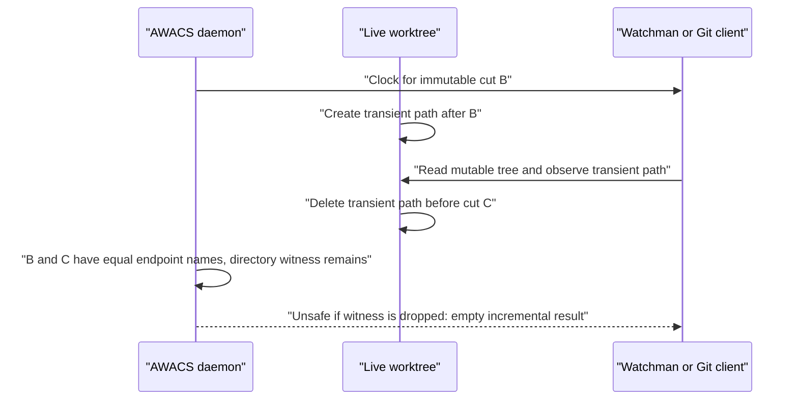

## Snapshot identity

A supported watch root is an exact Btrfs subvolume root. Its root inode is 256;
an arbitrary directory inside a subvolume is insufficient. Snapshot identity
includes the filesystem UUID, subvolume UUID, Btrfs root ID, parent/received
UUID where relevant, transaction information, and the read-only flag.

The identity that matters is not just a pathname. A reused pathname, different
subvolume with the same inode number, snapshot from another filesystem, or
changed namespace cannot safely substitute for the original root.

Managed snapshots live **outside** the watched worktree and on the same Btrfs
filesystem. Placing them inside the worktree would mutate the indexed namespace
and introduce nested-subvolume boundaries. Nested subvolumes and unsupported
fscrypt views are outside the supported watch contract.

## Objects, references, and raw paths

An `Index` consists of:

```text
objects:    inode -> generation, mode, owner, link count, privilege metadata
references: (child inode, parent inode, raw component name)
```

Directories have one parent reference; files may have multiple references
because hardlinks represent multiple visible names for one object. A path is
derived by walking references back to inode 256. Internal paths are
**repository-relative raw bytes**, such as `src/file.rs`; they do not have a
leading slash. `/` is reserved as a full-invalidation sentinel in the
compatibility projection.

The semantic event kinds are `PathAdded`, `PathRemoved`, `PathChanged`,
`SubtreeMoved`, and `DirectoryDirtyWitness`. A directory rename changes every
descendant pathname even if the kernel reports a compact parent/reference
change. A surviving directory witness records that a subtree may have undergone
changes whose intermediate names no longer exist at the final endpoint.

## The dirty-witness distinction

The custom kernel contract is intended to ensure that a post-snapshot
client-visible mutation changes either an emitted object or a surviving
ancestor's directory inode. This guarantee is essential for **live**
Watchman/Git scans, because a client can observe a transient name after it
received an older clock.

A **direct immutable scan** reads the exact leased snapshot instead. If a file
appears and disappears in the live root while the client scans that snapshot,
the client cannot accidentally cache that transient file from the immutable
root. The direct client still needs accurate endpoint changes, aliases,
directory-move coverage, authenticated continuity, and matching external
inputs.



The corresponding direct client reads immutable B, not `Live`, so this exact
transient-observation failure does not apply to direct snapshot traversal.
