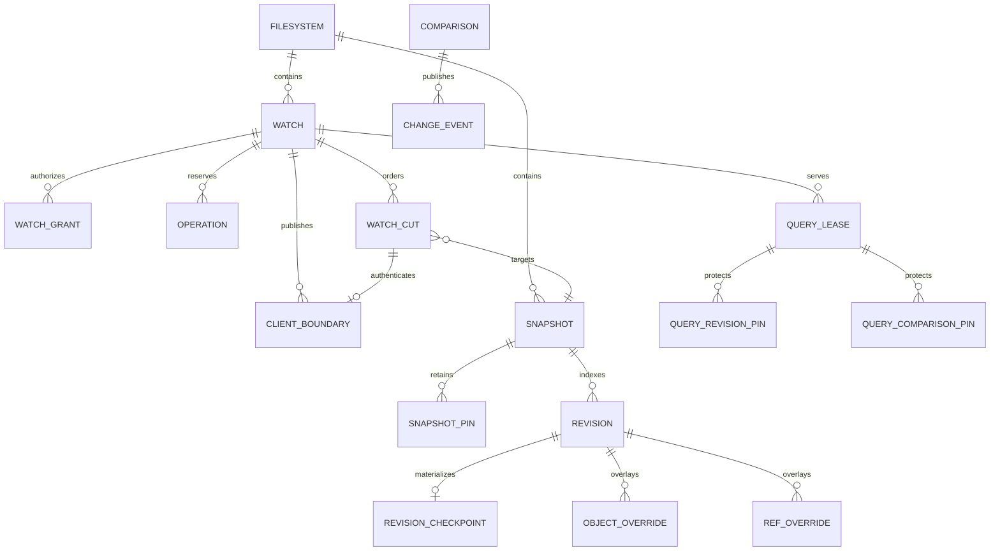

The manager database contains service metadata, an HMAC key, filesystems,
snapshots, revisions/checkpoints/overlays, comparisons and events, watches,
grants, operations, cut admissions, cut rows, client-visible boundaries,
query/retention leases, and snapshot pins. The privileged broker uses a
separate receipt database.



Key distinctions:

- A **physical cut head** records the newest managed read-only snapshot.
- An **indexed head** records the newest snapshot whose immutable namespace
  comparison has been validated and published.
- A **revision** describes one immutable inode/reference graph. Initial
  revisions can be complete checkpoints; subsequent revisions can be overlays.
- A **cut** orders snapshot transitions for one watch.
- A **client boundary** authorizes a particular published cut, cursor epoch,
  grant, monitor session, and target snapshot.
- A **pin** prevents physical snapshot reclamation while a head, operation,
  comparison, response, scan, or explicit retention lease requires it.
- A **broker receipt** persists the intent and outcome of a privileged
  filesystem mutation independently from the manager transaction.

SQLite foreign keys are enabled. Schema SQL is extracted from fenced blocks in
[`docs/indexed-change-tracking.md`](/reference/indexed-change-tracking/), so that
document is part of the executable schema input rather than merely explanatory
documentation.

## Automatic deployment layout

The current automatic activation uses:

```text
${XDG_RUNTIME_DIR}/btrfs-awacs/mnt-<device>-<inode>/
    daemon.lock
    scan.sock

${XDG_STATE_HOME:-$HOME/.local/state}/btrfs-awacs/
    <manager database>
    spool/

<watch-root-parent>/.btrfs-awacs-managed/
    managed read-only snapshots

/run/btrfs-awacs/broker.sock
    privileged broker, unless explicitly overridden
```

`BTRFS_AWACS_MANAGED_DIR`, `BTRFS_AWACS_SPOOL_DIR`,
`BTRFS_AWACS_MANAGER_DB`, and `BTRFS_AWACS_BROKER_SOCKET` override the
corresponding paths. Runtime directories must be private; public per-user
sockets are mode `0600`. The managed snapshot directory must stay on the same
Btrfs filesystem as its source root.
