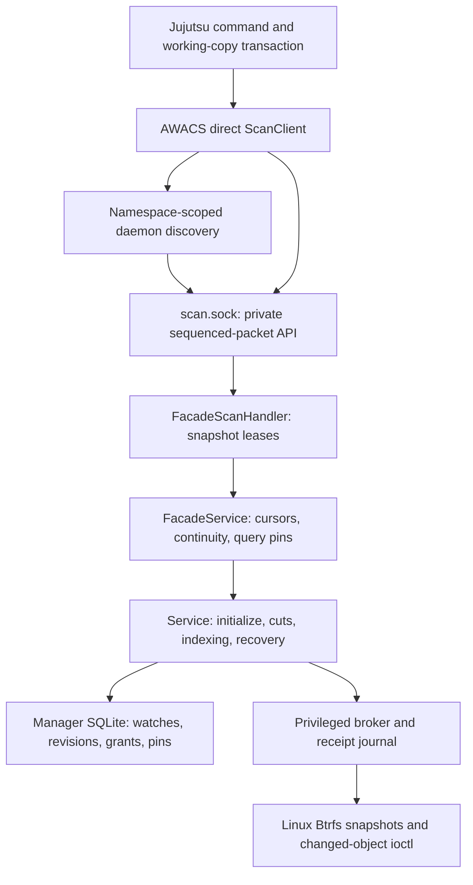

There are three authority domains:

1. **The client** owns the Jujutsu working-copy state.
2. **The per-user namespace daemon** owns watches, projections, scan sessions,
   continuity monitors, and the manager database connection.
3. **The privileged broker** performs constrained Btrfs operations and keeps a
   separate receipt journal for replayable filesystem effects.

A direct-scan request is not allowed to supply the broker's underlying
authority, manager database, managed-snapshot directory, or arbitrary
commands.
