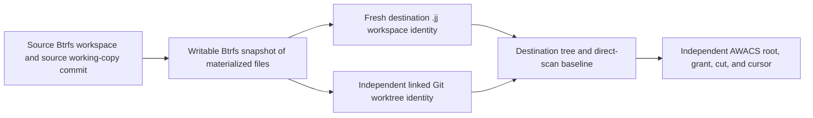

The Btrfs workspace mode is configured independently of the fsmonitor backend:

```toml
[btrfs]
enabled = false   # true, false, or "auto"
```

`jj workspace add --btrfs-snapshot=true <destination>` snapshots the current
Btrfs checkout. The snapshot preserves materialized tracked files and ignored
build outputs. It must then replace the copied source workspace identity with
independent `.jj` working-copy metadata.

For a Git-colocated repository, the destination also needs its own linked Git
worktree identity and `.git` pointer. Mutable Git refs/index/worktree state
must not be shared merely because a Btrfs snapshot duplicated the source
filesystem tree. After metadata initialization, Jujutsu records a working-copy
baseline derived from the source commit and applies the requested sparse
inheritance policy.

The physical repository-store topology is particularly important:

```text
primary-workspace/
    .jj/
        repo/                  # physical shared repository and operation store
        working_copy/          # primary workspace-private state

secondary-workspace/
    .jj/
        repo                   # file containing a path to the primary store
        working_copy/          # independent secondary state
```

For a colocated repository, the primary workspace can also contain the physical
Git repository/object database while secondary workspaces hold linked-worktree
metadata or pointers. Deleting the primary directory is not equivalent to
forgetting one workspace: it deletes the backing repository used by every
secondary workspace.



In `"auto"` mode the operation should retain ordinary Jujutsu behavior when a
Btrfs optimization is unavailable; in required `true` mode unsupported Btrfs
operations should fail explicitly. `jj git clone` can similarly create a new
destination as a Btrfs subvolume. `jj workspace remove` forgets its workspace
and then attempts Btrfs subvolume deletion or ordinary directory removal;
unprivileged deletion may require `user_subvol_rm_allowed`.

The lifecycle has several required safety invariants:

1. Optional snapshot fallback must discard all snapshot-only baseline state and
   fully materialize files with the ordinary workspace creation algorithm.
2. A workspace directory containing the shared `.jj/repo`, Git object database,
   current workspace, or an ancestor of either must never be deleted without
   first relocating those shared authorities.
3. The target directory must still be the requested workspace, not a replaced
   symlink or arbitrary canonicalized path.
4. Unsnapshotted target changes must be detected, preserved, or protected by an
   explicit force/confirmation contract before recursive deletion.
5. Filesystem deletion capability should be checked before forgetting durable
   workspace registration; failed deletion must not silently orphan the target.
6. Auto mode must preserve stock behavior for missing Btrfs tools, ordinary
   directories, existing empty destinations, and cross-filesystem paths.
7. A monitored source must not gain a nested subvolume that violates AWACS's
   no-descendant-boundary invariant.
8. A sparse source snapshot contains only currently materialized paths;
   requesting full destination sparsity must explicitly materialize every
   previously excluded tracked file before recording a full tree baseline.
9. Colocated Git worktree registration must be removed together with its
   workspace or explicitly migrated.

The current lifecycle violates several of these invariants, including two
repository-wide data-loss paths described in findings C-01 and C-02.

The direct AWACS handler registers each requested canonical root on demand.
When a destination snapshot descendant is first scanned, it adopts the known
lineage when possible, creates an independent grant/cut/cursor, and activates
its own namespace view in the already-running namespace daemon.
