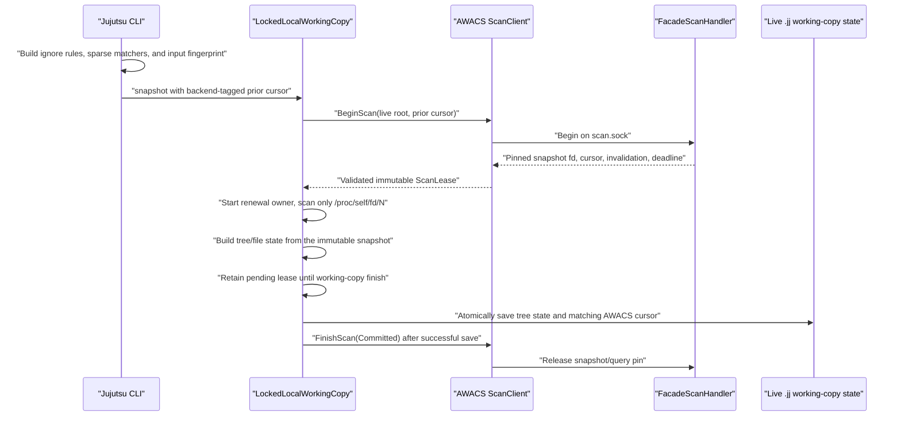

`TreeState` constructs a `SnapshotScan` with a selected scan root, optional
changed-path matcher, backend-tagged cursor, and optional pending completion.
The `none` and Watchman branches use the normal live working-copy path. The
direct AWACS branch:

1. Connects an injected test client or discovers/connects `SocketScanClient`.
2. Requires the versioned external-input fingerprint.
3. Sends the previous AWACS cursor only when its backend and fingerprint still
   match the current inputs.
4. Receives and validates the snapshot directory descriptor and identity.
5. Uses `/proc/self/fd/<descriptor>` as the scan root while retaining the fd.
6. Converts `ExactPaths` or `Prefixes` into ordinary Jujutsu matchers.
7. Reads `.gitignore`, directory entries, symlinks, file contents, executable
   bits, deletions, and tracked-state candidates from the immutable scan root.
8. Continues writing locks and `.jj/working_copy/tree_state` under the live
   workspace metadata path.
9. Starts a lease-renewal owner while the immutable scan remains active.
10. Keeps `PendingScan` on `LockedLocalWorkingCopy`, rather than dropping it at
    the end of `TreeState::snapshot`.
11. Saves the new tree state and AWACS cursor together before sending
    `FinishScan(Committed)`.

The ordering matters: `TreeState::snapshot` computes state but does not itself
persist it. `LockedLocalWorkingCopy::finish` is the durable boundary.

If traversal fails, an active renewal fails, the caller drops the transaction,
or checkout/reset/recovery/sparse mutation invalidates the immutable baseline,
the pending session must be aborted and its cursor cleared. Untracked paths
that Jujutsu cannot cache also prevent cursor persistence, forcing a fresh scan
later. A failure to acknowledge Finish after a successful state save is cleanup
failure; the already-saved tree/cursor pair remains the client-side durable
result, and the daemon must eventually expire its pin.

## Backend-tagged persistence

The working-copy protobuf now contains:

```text
TreeState {
    legacy watchman_clock: deprecated tag 4,
    fsmonitor_cursor: tag 8,
}

FsmonitorCursor {
    oneof {
        watchman: WatchmanClock,
        awacs: {
            opaque_token,
            input_fingerprint_version,
            input_fingerprint,
        },
    }
}
```

Existing legacy Watchman clocks can be read and migrated into the new field.
The current writer does not also populate deprecated tag 4, so an older/stock
Jujutsu binary cannot reuse a clock written by this checkout.

## Matcher and invalidation contract

The effective scan matcher intersects the Jujutsu sparse matcher with the union
of backend invalidation and explicitly force-tracked paths.

- `Full` selects every eligible sparse path.
- `ExactPaths` selects only those changed paths.
- `Prefixes` selects entire changed subtrees.
- A changed `.gitignore` adds its parent subtree to the rescan set.
- A worktree-relative global excludes file is read from the immutable scan root
  and currently forces a conservative full traversal.
- An empty incremental invalidation can safely skip tree traversal only when
  the prior cursor, tree state, fingerprint, and backend all describe the same
  baseline.

Malformed, absolute, nonrepresentable, or parent-escaping invalidation paths
must fail closed or force `Full`; silently dropping such a path and then
advancing the cursor would lose changes.
