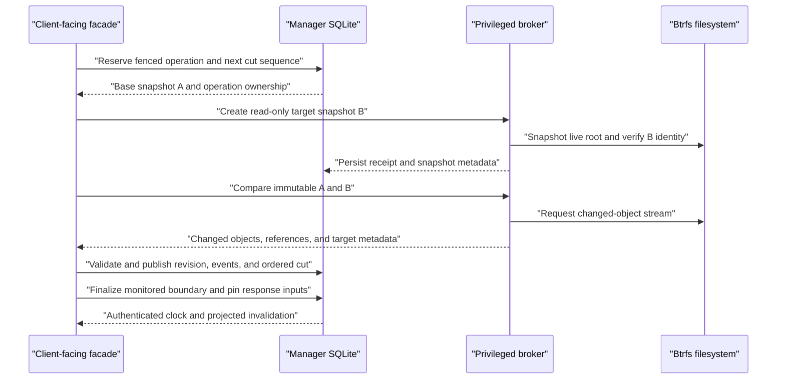

The durable operation progresses through states equivalent to:

```text
planned
    -> fs_started
    -> fs_created / uuid_recorded
    -> manifest_ready
    -> index_committed
    -> done
```

The changed-object stream identifies created/deleted/replaced objects,
reference additions/removals, inode metadata, file-content/xattr changes,
nested-boundary transitions, and directory witnesses. Applying a manifest must
resolve old paths against snapshot A and new paths/all hardlink aliases against
snapshot B.

Snapshots are cut in sequence for a watch; comparison/indexing should not
publish a later indexed head before its predecessor is valid. A fallback
full-fresh checkpoint is needed when incremental continuity or the kernel ABI
cannot support the requested delta. A client must receive an explicit full
invalidation for such a checkpoint, not a partially valid incremental result.

**Current caveat:** the implementation advances the physical head before some
immutable target validations complete. An unsupported nested subvolume or
fscrypt entry can therefore leave an unrecoverable invalid target as the
physical head; see finding C-05.
