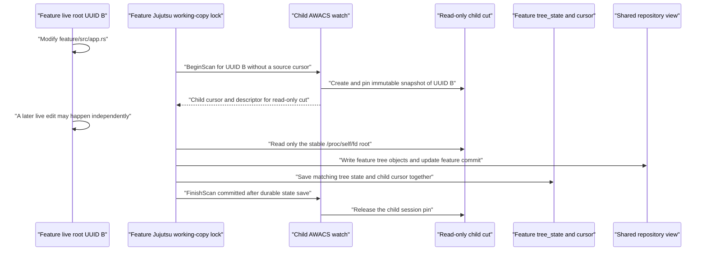
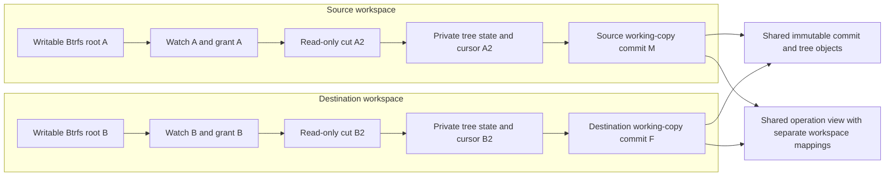

The [previous walkthrough](/walkthroughs/new-snapshot-worktree/) ended with two
independent writable Jujutsu workspaces backed by one shared repository. Now
edit a tracked file in the new workspace and run its first `jj status`.

The question is not merely whether the file appears as modified. Correctness
requires the right **workspace root**, **working-copy commit**, **AWACS watch**,
**read-only snapshot**, **external-input fingerprint**, and **persisted cursor**
to remain paired throughout the operation.

:::danger[Current direct-AWACS behavior]
The existing namespace daemon binds its direct scanner to the first workspace
root. If `main/` started that daemon, the first `BeginScan` for `feature/`
fails with `AWACS scan root does not match the registered live root`. Steps
describing a successful direct child scan below specify the required lifecycle
after finding C-10 is fixed; they are not a claim that the present
multi-workspace direct path already works.
:::

## Initial state after workspace creation

```text
/projects/main/
    live writable Btrfs root UUID A
    private JJ working-copy commit M
    private tree state and cursor for watch WA, if initialized

/projects/feature/
    live writable Btrfs root UUID B, parent_uuid A
    private JJ working-copy commit F
    private tree state matching F and its sparse matcher
    no direct AWACS cursor yet
    private Git linked-worktree state, if colocated

/awacs-managed/
    read-only managed cuts belonging to explicitly identified watches
```

The source and destination may share Btrfs extents, Jujutsu/Git objects, the
operation store, and a mount-namespace daemon. They must not share mutable
working-copy state, Git indexes, watch identities, root authorizations, or
cursor continuity.

For example:

```sh
cd /projects/feature
printf 'feature change\n' >> src/app.rs
jj status
```

The append changes UUID B's live root only. Copy-on-write ensures UUID A still
contains its original file bytes.

## Step 1: Resolve the child workspace and coordinate shared state

**Owner:** `cli/src/cli_util.rs::CommandHelper::workspace_helper_with_stats`
and `lib/src/workspace.rs`.

The CLI resolves `/projects/feature/.jj`, reads its `.jj/repo` pointer, loads
the shared repository, and resolves the **child's own** workspace name and
checkout operation. It does not reuse the source's `working_copy/tree_state`.

When colocated, it obtains the repository-wide `git_import_export.lock`
before synchronizing Git HEAD/refs and loading a repository view that could be
updated concurrently by the sibling. The child then takes its own
working-copy file lock before replacing its tree state or working-copy commit.

The repository-wide Git coordination lock and the per-workspace working-copy
lock have different scopes: siblings share the former but must never contend
on one copied mutable working-copy lock simply because Btrfs duplicated the
source directory.

**Invariant:** The selected workspace commit is `F`, the working-copy root is
UUID B, and every mutation of `feature/.jj/working_copy` is protected by the
child's own lock.

## Step 2: Bind ignore rules, sparsity, and external inputs

**Owner:** `cli/src/cli_util.rs::snapshot_options_with_start_tracking_matcher`
and `awacs_input_fingerprint`.

Jujutsu builds the effective ignore matcher and tracking policy for the child,
then computes a versioned SHA-256 fingerprint for inputs not frozen by an
immutable workspace snapshot:

- Absolute Git global excludes and `.git/info/exclude` contents.
- Git sparse-index state and child-specific Jujutsu sparse prefixes.
- `snapshot.auto-track`, fileset aliases, and maximum new-file size.
- Effective executable-bit and end-of-line conversion policies.

A worktree-relative `core.excludesFile` is instead read from the selected scan
root; the current direct backend conservatively forces a full sparse traversal
when such an input exists. A cursor remains reusable only when its backend,
fingerprint version, and exact fingerprint match this child's current scan
inputs.

**Currently broken — C-07:** External ignores are first read into the matcher
and then reread for the fingerprint. Editing an external ignore between those
reads can pair an old tree decision with a new fingerprint, poisoning later
incremental scans.

**Currently broken — C-08 and C-09:** Relative global-ignore handling is
missing in some existing snapshot callers and has reversed precedence in
normal snapshots. These regressions affect `none` and Watchman too, not only
direct AWACS.

## Step 3: Determine which monitor path owns the initial baseline

**Owner:** `lib/src/local_working_copy.rs::TreeState::make_snapshot_scan`.

The new child's saved monitor state depends on the configured backend:

| Backend | Child's first effective scan | Root that traversal reads |
| --- | --- | --- |
| `none` | Full ordinary Jujutsu scan against the child's own recorded tree. | Mutable `/projects/feature`. |
| `watchman` | Resolve/register the child root and query its own fresh or saved clock. | Mutable `/projects/feature`, filtered by Watchman results. |
| `awacs` | Send a direct `BeginScan` for the child with no inherited cursor. | Read-only `/proc/self/fd/N` from the child's managed snapshot. |

`mark_fsmonitor_baseline` during workspace creation records a fresh clock for
Watchman, but for direct AWACS it only clears the old cursor. It does not
register a child direct watch or send Begin. A later destination checkout or
sparsity change clears incompatible monitor state again.

**Invariant:** A Watchman clock and direct AWACS token are backend-tagged and
never interchangeable. A source-root clock or token must never be used as the
first child-root baseline.

## Step 4: Register or adopt the child root

**Watchman owner:** `src/watchman.rs::watch_project`,
`src/service.rs::adopt_snapshot_descendant`, and
`src/manager.rs::adopt_snapshot_descendant`.

When using the compatibility endpoint, Jujutsu resolves
`/projects/feature` as a Watchman root. AWACS authenticates the requesting
principal, opens UUID B, observes B's `parent_uuid = A`, and looks for a
ready, present retained revision associated with A on the same filesystem.

If a usable parent seed exists, AWACS transactionally creates a new child
watch, child authorization grant, child clock epoch, and two head pins. Its
index can start from immutable source history without reusing the source's
watch sequence or cursor. If there is no eligible seed, the Watchman endpoint
currently falls back to a new read-only initialization snapshot and full
indexing.

**Direct owner:** `src/main.rs` and `src/scan_facade.rs::begin_scan`.

The required direct behavior is to resolve and authorize UUID B independently,
adopt or initialize its watch using the same safe lineage logic, and bind the
session to that child watch. The current code instead constructs exactly one
`FacadeScanHandler` with the daemon's original `expected_live_root` and
`watch_id`:

```text
daemon started for /projects/main
child requests BeginScan(live_root = /projects/feature)
canonical child root != daemon.expected_live_root
result: Unauthorized
```

**Currently broken — C-10:** Namespace-scoped daemon discovery and fixed-root
direct dispatch disagree. Even a valid sibling snapshot with retained lineage
cannot obtain its first direct scan. This is a correctness boundary, not a
missing source cursor or a Btrfs copy-on-write problem.

## Step 5: Request the child's first immutable cut

**Owner, once child dispatch is fixed:**
`src/scan_facade.rs::FacadeScanHandler::begin_scan`,
`src/facade.rs::prepare_scan_query`, and `src/service.rs::changes`.

Jujutsu sends:

```text
BeginScan {
    live_root: "/projects/feature",
    previous_cursor: None,
}
```

The daemon must validate the requested root, UID/GID, filesystem UUID,
subvolume UUID, child watch ID, authorization grant, and active mount/view
continuity. Because the child has no prior direct cursor, the response must
be safely fresh: the child's initial tree comparison cannot rely on the
source's clock.

The service reserves a fenced child-watch cut, asks the privileged broker to
create a new **read-only** snapshot of UUID B, verifies immutable endpoint
identities, indexes or compares the cut, and prepares a pinned response. The
broker's read-only cut is distinct from the writable Btrfs snapshot that
created `feature/`.

The response carries:

1. One immutable snapshot-directory descriptor transferred with `SCM_RIGHTS`.
2. The descriptor's verified filesystem and subvolume identity.
3. A new opaque child-watch cursor.
4. `Invalidation::Full`, `ExactPaths`, or `Prefixes`.
5. A session identity and lease deadline protecting the pinned cut.

**Invariant:** The returned descriptor must represent a read-only cut of UUID
B, the token must belong to the child watch and grant, and the pin must remain
valid until the child's durable transaction commits or aborts.

## Step 6: Traverse immutable child contents while live edits continue

**Owner:** `TreeState::make_snapshot_scan`, `AwacsScanSession`, and
`FileSnapshotter` in `lib/src/local_working_copy.rs`.

The client validates the descriptor and constructs its read root as
`/proc/self/fd/<descriptor>`. A renewal thread protects the daemon session.
Directory enumeration, nested `.gitignore` reads, file contents, executable
bits, symlinks, tracked-file absence, and relative global excludes are read
from that **immutable** root.

Locks, commit/object writes, and
`/projects/feature/.jj/working_copy/tree_state` remain associated with the
child's live metadata and shared object store. The scan must not redirect
metadata writes into the read-only cut.

The effective matcher is:

```text
child sparse matcher
    intersect
    (AWACS exact paths or prefixes, union explicitly force-tracked paths)
```

A fresh response visits every eligible sparse path. Subsequent responses should
visit only invalidated child paths unless an ignore/sparsity change or malformed
proof requires a conservative full traversal.

**Currently inefficient — P-03:** AWACS indexes emit repository-relative paths
such as `src/app.rs`, while `direct_invalidation` currently expects
`/src/app.rs`. Every real nonempty response therefore degrades to `Full`, so
the first changed child command after initialization is a full crawl even once
root routing is repaired.



## Step 7: Construct the child tree and commit

**Owner:** `TreeState::snapshot_with_pending` and Jujutsu's working-copy
transaction in `cli/src/cli_util.rs`.

The snapshotter compares immutable child-cut files with the child's previous
tree/file states, writes changed blobs and tree objects to the **shared**
repository object store, and updates only the child's recorded working-copy
tree. The changed `src/app.rs` becomes part of the new tree for child commit
`F`; source commit `M` does not acquire that content.

Repository operations and commit objects are globally visible because the
operation store is shared. That does not mean the source automatically checks
out the child commit: the repository view retains an independent
`workspace-name -> working-copy-commit` mapping for each workspace.

If the scan encounters untracked files that Jujutsu cannot cache or represent,
it deliberately clears the pending cursor and aborts the direct session. A
future scan must be fresh rather than falsely asserting that the skipped
untracked state is represented by the saved tree.

**Invariant:** The saved child tree describes exactly the read-only child cut
used to derive its cursor. Shared visibility of objects and operations must
never redirect the source's checkout or working-copy mapping.

## Step 8: Commit tree state before releasing the cut

**Owner:** `lib/src/local_working_copy.rs::LockedLocalWorkingCopy::finish`.

The direct session is retained on `LockedLocalWorkingCopy`, not discarded when
tree computation returns. The final boundary is deliberately ordered:

1. Stop the child's lease-renewal owner and check that the session remained
   healthy.
2. If renewal failed, abort the session, clear the unsafe cursor, and retain
   only a tree that forces a future fresh scan.
3. Atomically save the child's tree IDs, file states, sparse patterns, and
   matching backend-tagged AWACS cursor to its private `tree_state` file.
4. Send `FinishScan(Committed)` only **after** that save succeeds.
5. Release the daemon's child-watch query pin and update the child's checkout
   operation as needed.

If the state save fails, drop/abort the pending session without claiming its
cursor. If Finish fails after a successful atomic save, the tree/cursor pair
is already the durable client result; daemon-side expiry must eventually
release the remaining pin.

**Currently broken — C-11, C-16, and C-25:** Server expiration is calculated
from a stale wall-clock value while the client receives a fresh boot-time
deadline; a global handler lock can block child/source lease renewal behind an
unrelated slow Begin; and failed Begin-response delivery can leak a pin until
some later request happens to clean up the session.

## Step 9: Observe the child and source independently

After a successful child status, the desired state is:

```text
main/
    live root: UUID A
    working-copy commit: M
    tree state: source state
    monitor cursor: source cursor, unchanged by child status

feature/
    live root: UUID B
    working-copy commit: updated F
    tree state: immutable child-cut tree
    monitor cursor: child cursor for the same cut and fingerprint

shared repository/
    object store: contains both source and child commit/tree objects
    operation view: maps main -> M and feature -> updated F
```

Running `jj status` in `main/` can discover a newer shared repository
operation, but its filesystem scan must still resolve UUID A, its own tree,
and its own AWACS cursor. It must not interpret `feature/src/app.rs` as a
change to `main/src/app.rs`.

Conversely, a later edit to `main/src/app.rs` does not mutate the child's
writable Btrfs root or validate a child cursor. Each root needs its own
subsequent read-only cut and watch continuity.

## Step 10: Repeat edits and reason about concurrent sibling commands

Suppose the child has saved cursor `B1` and is scanned again while the source is
independently edited:

```text
feature edit 1 -> feature immutable cut B1 -> save child tree + cursor B1
main edit      -> main immutable cut A2    -> save source tree + cursor A2
feature edit 2 -> feature immutable cut B2 -> save child tree + cursor B2
```

The second child request sends `previous_cursor = B1`, never `A2`. AWACS
compares child history between B1 and B2. The source's A2 mutation and Btrfs
copy-on-write divergence are irrelevant to that child range, although both
commands can contend for shared Git synchronization, SQLite writer access, or
the current daemon's global scan-dispatch lock.

A live child mutation after B2 is cut but before B2 traversal finishes must
appear in a *later* child cut. It must not alter bytes read from B2 or be
silently discarded when cursor B2 is saved. This immutable-cut boundary is the
key distinction from the Watchman compatibility path, which hands Jujutsu
paths and a clock but then traverses the mutable live child root.

**Current Watchman limitation — C-04 and C-14:** AWACS drops
directory-dirty-witness information before returning compatibility paths. A
transient file visible during a mutable Watchman crawl can disappear before a
later cut, leaving an incorrectly clean incremental result. Immutable direct
child scans avoid this particular race, but only after the independent-root
routing bug is fixed.

## Step 11: Remove a child without destroying its siblings

**Owner:** `cli/src/commands/workspace/remove.rs`.

A safe removal must first verify the exact child workspace identity without
following substituted symlinks, lock and preserve any unsnapshotted changes,
confirm Btrfs deletion capability, and protect the directory containing the
physical shared `.jj/repo` or Git object store. It must revoke or safely drain
the child's watch/pins, unregister its Git linked worktree, update the shared
workspace view/store, and remove only the verified child root.

The current implementation does not meet those invariants:

- **C-01:** Removing the primary workspace from the child deletes the shared
  repository needed by every sibling.
- **C-18:** Removing a sibling discards its unsnapshotted tracked or untracked
  edits without checking them.
- **C-19:** A replaced workspace path can resolve through a symlink and delete
  an unrelated directory.
- **C-20 and C-21:** Failed Btrfs deletion or missing optional tooling can
  occur after the workspace has already been forgotten.
- **C-30:** Colocated removal leaves stale Git linked-worktree administration.

These hazards are independent of whether the destination started as a Btrfs
snapshot; ordinary workspaces also require shared-storage and target-identity
protection.

## Root, commit, and cursor isolation



## First-worktree-scan invariants

1. Every child request is authorized against the child's exact root UUID,
   filesystem, workspace name, watch, grant, and mount view.
2. Child watch initialization may reuse a retained parent revision but must
   create an independent watch identity, clock epoch, and pin ownership.
3. An initial child scan never inherits a source cursor or assumes an
   uninitialized sequence-zero watch is a client-visible boundary.
4. The saved cursor backend, fingerprint, tree, sparse matcher, and immutable
   cut describe the same child state.
5. Direct traversal reads files and in-tree ignore rules only through the
   leased read-only child descriptor.
6. Writes, locks, and persisted checkout state remain in the live child's
   private metadata and the intentionally shared repository store.
7. Live mutations after a cut are deferred to a later cut rather than
   contaminating the immutable traversal.
8. Successful state persistence precedes `FinishScan(Committed)`; failures
   abort or clear any unsafe cursor and eventually release every pin.
9. Source and child operations can share objects and locks without sharing
   mutable Git indexes, working-copy mappings, watch histories, or cursor
   ranges.
10. Removal preserves shared stores, sibling edits, verified path ownership,
    linked Git registration, and every active snapshot/session lifetime.

Continue to the [complete review and active findings](/review/overview/), or
inspect the detailed [direct scan protocol](/integrations/direct-scan-api/),
[Jujutsu transaction ordering](/integrations/jujutsu-transaction/), and
[concurrency and lease rules](/lifecycle/concurrency-and-leases/).
