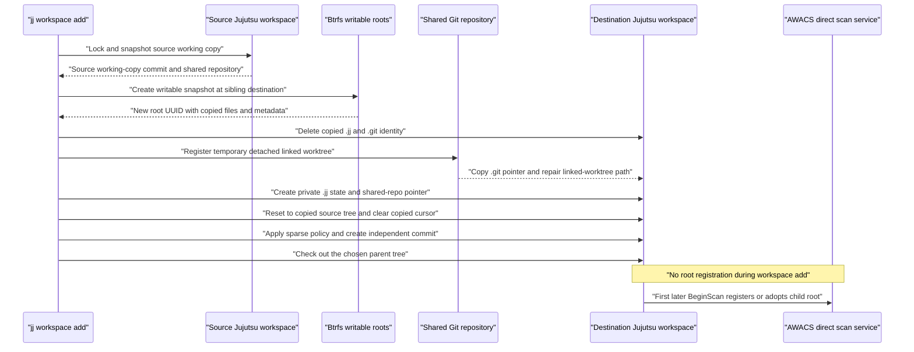
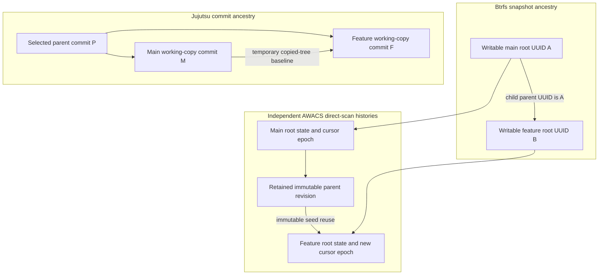

The first two walkthroughs follow one working checkout. This one introduces a
second checkout created with `jj workspace add`. The destination is a **writable
Btrfs snapshot**, but it must become an independent Jujutsu workspace and, when
colocated, an independent Git linked worktree. Sharing file extents is useful;
sharing mutable workspace identity, cursors, or indexes is incorrect.

:::caution[Implementation status]
This walkthrough distinguishes the intended lifecycle from behavior that the
current source does not implement correctly. The unsafe automatic-fallback
baseline is remediated in the current source, while sparse widening can still
omit tracked files. Remaining failures are identified at the exact steps where
they occur.
:::

## Starting conditions and names

Assume the source and destination will be **directory siblings** on the same
Btrfs filesystem:

```text
/projects/
    main/                         existing writable Btrfs subvolume
        .jj/repo/                 physical shared Jujutsu repository
        .jj/working_copy/         source-only checkout and tree state
        .git/                     physical Git repository, if colocated
        src/app.rs
        target/                   ignored build output

    feature/                      does not exist yet

/awacs-managed/                   separate private managed-snapshot directory
```

The example command is:

```sh
jj workspace add --btrfs-snapshot=true ../feature
```

`--name` overrides the destination basename. `--revision` chooses explicit
working-copy parents, and `--sparse-patterns` selects `copy`, `full`, or
`empty`. Configuration can instead request Btrfs behavior with
`btrfs.enabled = true`, `false`, or `"auto"`.

Three different kinds of “snapshot” appear in this walkthrough:

1. A **Jujutsu working-copy snapshot** reads files and updates a commit/tree.
2. A **writable Btrfs workspace snapshot** creates `feature/` with shared
   copy-on-write extents.
3. A **read-only AWACS cut** freezes one workspace root for indexing or a
   direct immutable scan.

They have different owners, identities, persistence boundaries, and lifetimes.



## Step 1: Snapshot and lock the source workspace

**Owner:** Jujutsu CLI, `cli/src/commands/workspace/add.rs::cmd_workspace_add`
and `cli/src/cli_util.rs::CommandHelper::workspace_helper`.

Before choosing a destination, the command loads the **source** workspace,
acquires the shared `git_import_export.lock` when applicable, and snapshots its
working copy unless global options disable snapshotting. This is a normal
Jujutsu snapshot; if direct AWACS is enabled, the source may already perform a
complete immutable scan transaction.

The resulting source commit describes the tracked tree against which the
filesystem optimization will establish its temporary destination baseline.
Ignored build outputs can also be physically copied by Btrfs even though they
are not present in that commit.

**Invariant:** The source command must not accidentally treat destination
state as source state. A source Jujutsu commit, source AWACS cursor, source
workspace name, and source Git worktree identity are four distinct pieces of
authority that cannot simply be copied into a usable child.

## Step 2: Resolve the snapshot policy and destination identity

**Owner:** `cli/src/commands/workspace/add.rs::cmd_workspace_add`.

An explicit `--btrfs-snapshot=true` requires a snapshot; `false` requires
ordinary materialization. Without that flag, `btrfs.enabled` selects required,
disabled, or optional `"auto"` behavior. The command derives the workspace
name from `--name` or the destination basename and rejects an existing name in
the shared repository view.

For a real Btrfs snapshot, the destination must not already exist, the source
must be a writable subvolume root, and the destination must be on the same
filesystem. Crucially, **the destination must not be underneath the monitored
source**: directory siblings can have parent/child snapshot lineage without
creating an unsupported nested subvolume.

**Currently broken — C-22:** The command accepts destinations inside the
source checkout. A writable child subvolume beneath an already registered root
violates AWACS's no-nested-subvolume invariant, so a later source cut can fail.
The C-05 remediation must reject that invalid cut without advancing the
physical head, but workspace add should prevent the unsupported layout in the
first place.

**C-21, C-28, and C-29 status:** The current lifecycle remediation preserves
stock behavior for a missing `btrfs` executable, an existing empty
destination, or an otherwise valid destination on another filesystem when
mode is auto. Required `true` mode instead preserves the snapshot error and
fails workspace creation. Keep these findings open until the supported-host
acceptance matrix passes.

## Step 3: Create a writable copy-on-write Btrfs root

**Owner:** `cli/src/commands/workspace/add.rs::create_btrfs_snapshot`, invoking
`btrfs subvolume snapshot <source> <destination>`.

The destination receives the source's currently materialized directory tree,
including ordinary tracked paths, ignored build artifacts, and temporarily its
`.jj` and `.git` metadata. Btrfs initially shares data and metadata extents by
copy-on-write. A later edit in either root diverges without editing the other
root's live file contents.

The destination is **writable**, has its own subvolume/root identifier and UUID,
and reports the source subvolume UUID as its Btrfs snapshot `parent_uuid`.
The parent's UUID proves filesystem ancestry; it is not a Jujutsu commit ID,
an AWACS root-state ID, or a directory-parent relationship.

**Invariant:** An optimization may share immutable objects and copy-on-write
extents. It must never give two active workspaces the same mutable checkout
state, Git index, AWACS root state, authorization grant, or persisted cursor.

### The optional-fallback boundary

The current code assigns `snapshot_source_commit` only after
`create_btrfs_snapshot` confirms a physical snapshot. If optional auto mode
falls back, `snapshot` becomes false while the snapshot-only baseline remains
absent, so ordinary workspace initialization and checkout materialization run.
Required snapshot mode still returns the snapshot failure instead of creating a
workspace.

`TreeState::reset` creates tracked file-state entries without writing missing
files. That remains valid only after a successful Btrfs snapshot has already
copied the expected files; an ordinary fallback must never use that path or
fabricate a direct cursor for it.

**C-02 status:** The unsafe fallback baseline is remediated in the current
source. Keep the finding open until the non-Btrfs, cross-filesystem,
absent-tooling, and existing-empty-destination acceptance matrix passes.

## Step 4: Remove copied workspace identities

**Owner:** `create_btrfs_snapshot` and `remove_copied_metadata`.

Immediately after the writable snapshot, Jujutsu removes `feature/.jj` and
`feature/.git` from the child. It uses `symlink_metadata`, recursively removes
actual directories, and unlinks files or symbolic links without following
them.

The copied `.jj` otherwise contains the source workspace name, operation,
working-copy tree, locks, and direct-scan cursor. The copied `.git` otherwise
contains or points at the source's mutable Git worktree identity. Neither copy
is a valid independent workspace.

**Currently expensive — P-09:** When the source physically contains a large
`.jj/repo` or `.git/objects`, recursively deleting those copied directory trees
walks potentially enormous metadata and triggers copy-on-write updates. The
logical isolation is necessary; the current physical layout forfeits much of
the intended cheap-snapshot benefit.

## Step 5: Create an independent linked Git worktree

**Owner:** `create_git_worktree_with_existing_files` and
`create_git_worktree` in `cli/src/commands/workspace/add.rs`.

This step applies only when the source is colocated with Git. The destination
already contains materialized files, so asking Git to check out directly over
them would be incorrect. Instead, the implementation:

1. Canonicalizes the existing shared Git repository and records the source
   commit to use as the detached checkout identity.
2. Acquires the shared `git_import_export.lock`.
3. Creates an empty temporary sibling directory.
4. Executes `git worktree add --force --no-checkout --detach --quiet` for that
   temporary path.
5. Copies the small generated `.git` **pointer file** into `feature/.git`.
   A rename across the Btrfs subvolume boundary can fail with `EXDEV`.
6. Runs `git -C feature worktree repair` so the shared administrative
   registration points to the real destination rather than the temporary
   directory.

The object database is shared, but the linked worktree has its own Git
administrative identity, HEAD, and mutable index. It must not keep using a
copied source `.git` directory or source worktree registration.

**Invariant:** Sharing Git objects is safe; sharing one mutable worktree index
or pretending that two checkout directories have the same Git worktree
identity is not. Registration and repair must either complete together or be
cleaned up safely after failure.

## Step 6: Create private Jujutsu state pointing at the shared store

**Owner:** `lib/src/workspace.rs::Workspace::init_workspace_with_existing_repo`.

The library creates a fresh `feature/.jj` directory, canonicalizes the
existing repository path, and writes `feature/.jj/repo` as a **file containing
a relative path** to the original physical store. It initializes a new
`feature/.jj/working_copy` tree and checkout identity, then registers the new
workspace name and root in the shared `SimpleWorkspaceStore`.

The resulting physical topology is asymmetric:

```text
/projects/main/
    .jj/
        repo/                        physical shared op, view, and object state
            workspace_store/         registration for main and feature
            git_import_export.lock   shared Git coordination
        working_copy/
            checkout                 source workspace identity and operation
            tree_state               source tree, file states, and cursor
    .git/
        objects/                     shared Git objects, if colocated
        worktrees/<feature>/         destination-only linked-worktree state

/projects/feature/
    .jj/
        repo                         relative pointer to main/.jj/repo
        working_copy/
            checkout                 independent destination identity
            tree_state               independent destination tree and cursor
    .git                             pointer to its linked-worktree admin
```

**Invariant:** Every workspace must resolve the same shared Jujutsu repository
and operation store while retaining its own name, working-copy commit,
checkout operation, tree/file-state cache, sparse policy, and direct-scan
cursor.

**C-01 status:** The current remediation preflights and revalidates removal,
rejecting a target that contains shared Jujutsu or Git storage before deletion.
The primary store owner must remain protected or relocated before its directory
can ever be deleted; keep the finding open until the supported acceptance
matrix passes.

## Step 7: Record the copied source tree as a temporary baseline

**Owner:** `cmd_workspace_add` and `LockedLocalWorkingCopy::reset`.

For an actual writable snapshot, Jujutsu temporarily associates the child with
the source working-copy commit in the shared repository view. It then locks
the **child's** working copy and calls `reset(source_commit)`. Reset records
the source tree and synthetic file-state entries; it does not materialize
files. That is valid only because a successful Btrfs snapshot already copied
the expected files.

Next it clears any copied direct-scan cursor. Workspace creation does not send
`BeginScan`, register the child root, or initialize a child cursor. The first
later command that scans the child establishes its own immutable direct
baseline.

Finally the child's lock is finished against the new shared operation ID. The
copied source cursor must not survive this transition.

## Step 8: Select sparsity and the destination working-copy commit

**Owner:** `cmd_workspace_add`, `merge_commit_trees`, and
`WorkspaceCommandTransaction::finish`.

With default `--sparse-patterns=copy`, Jujutsu copies the source workspace's
sparse prefixes. `empty` installs no prefixes. `full` leaves the default full
destination matcher unchanged.

The child's *final* initial commit is not necessarily the captured source
commit:

- Without `--revision`, Jujutsu uses the **parents of the source working-copy
  commit** as the new commit's parents.
- With one or more `--revision` arguments, it uses those selected commits.
- It merges the chosen parent trees, writes a new working-copy commit, edits
  that commit in the child workspace, commits the shared operation, and checks
  out the resulting tree in the child.

The source workspace keeps its own working-copy commit. Any child checkout or
sparse-policy change that changes the tree clears the child's earlier
direct-scan cursor; ignored files not targeted by the checkout can remain in
the writable snapshot.

**Currently broken — C-17:** A sparse source physically lacks files outside its
sparse matcher. When the destination requests `--sparse-patterns=full`, the
current code records the complete source tree but does not materialize missing
unchanged paths. A subsequent scan interprets those missing files as tracked
deletions. Widening must materialize the difference before claiming a complete
destination baseline.

## Step 9: Understand when AWACS can adopt the child

**Owner:** `src/scan_facade.rs::FacadeScanHandler::ensure_registered_root`,
`src/service.rs::adopt_snapshot_descendant`, and
`src/manager.rs::adopt_snapshot_descendant`.

The first later direct `BeginScan` canonicalizes the requested child path and
looks for an active root registration that grants the requesting UID read and
cut permissions. If none exists, the handler opens the child's Btrfs
subvolume, reads its `parent_uuid`, and first tries to adopt a ready, retained
parent revision on the same filesystem. A successful adoption transaction
creates:

- A new child root-state ID and authorization grant.
- A new child cursor epoch and child live-root UUID.
- Child indexed-head and last-cut pins referencing the retained parent seed.
- An independent watch sequence initialized at zero.

The source revision may be reused as immutable seed data; the source's epoch,
grant, live root, and cursor are never copied. Sequence zero is internal watch
initialization, not proof that the child already has a client-visible direct
scan boundary.

If no eligible seed exists, the handler initializes an independent root from a
new read-only cut and full index. After either path, it activates a facade
binding for the exact canonical child path. One namespace scan socket can
therefore serve `main/` and `feature/` while each request remains bound to its
own root, grant, durable history, and cursor domain.

## The four independent parent relationships



A Btrfs snapshot parent, a Jujutsu commit parent, an AWACS historical seed, and
a directory parent are not interchangeable. In the example, `main/` and
`feature/` are directory siblings even though the child subvolume's
`parent_uuid` identifies `main/`.

## Initialization invariants

1. Snapshot optimization must not change ordinary `jj workspace add` results.
2. Optional fallback must fully materialize stock files and discard every
   snapshot-only baseline.
3. Destination and source subvolumes must have distinct writable-root UUIDs on
   the same filesystem, with a verifiable snapshot lineage when claimed.
4. A registered workspace root must not gain a nested descendant subvolume.
5. The copied `.jj` identity and copied mutable Git identity must be replaced.
6. The destination must have an independent JJ name, working-copy commit,
   checkout operation, lock, tree cache, sparse matcher, and cursor.
7. Shared repository and Git object stores must outlive every workspace that
   references them.
8. Sparse widening must create missing tracked files before recording a full
   baseline.
9. A destination direct registration must have its own root, grant, cursor
   epoch, cursor, and authorization even when its immutable index is seeded
   from its parent's history.
10. The source workspace must remain usable if destination setup, Git repair,
    registration, or direct-scan setup fails.

Continue with [the new worktree's first changes and snapshots](/walkthroughs/first-worktree-changes/),
or compare the [Btrfs workspace integration reference](/integrations/btrfs-workspaces/)
with the [P0 correctness findings](/review/p0-correctness/).
