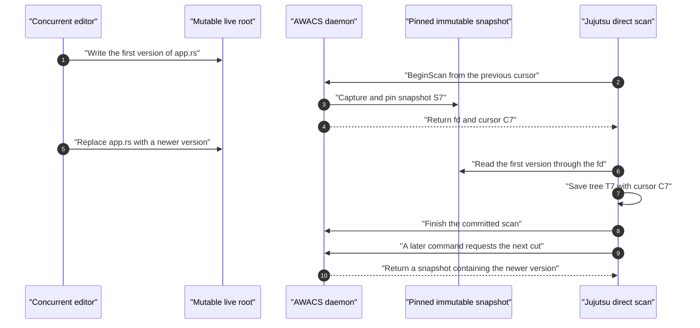
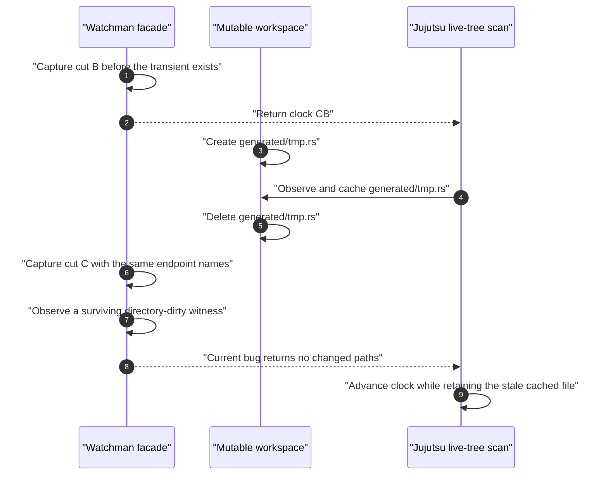

Real working directories do not stop changing when `jj status` begins.
Editors, formatters, generators, Git integrations, and other commands can
modify files while AWACS creates a Btrfs cut or Jujutsu traverses a tree. This
walkthrough identifies which concurrency is safe, where the boundaries are,
and which reviewed implementation paths currently violate those boundaries.

Read [One workspace: changes in sequence](/walkthroughs/single-workspace-serial/)
first for the state notation and normal publication flow.

## Four independent concurrency domains

| Domain | Owner | Serialized operations | Operations that can still race |
| --- | --- | --- | --- |
| Live workspace | Editors, build tools, and filesystem callers. | Filesystem operations receive their normal kernel semantics. | Any external writer can run before, during, or after a cut or traversal. |
| Jujutsu working-copy state | `LockedLocalWorkingCopy`. | Jujutsu commands updating the same workspace's recorded state hold its workspace lock. | External editors and clients with independent state are not excluded. |
| AWACS watch history | Manager SQLite and fenced broker operations. | Cut ordering, indexed revision publication, monitor boundaries, and grants for a watch. | Different clients can request overlapping cuts or retain earlier snapshots. |
| Direct scan sessions | `FacadeScanHandler` and query leases. | Session registration, renewal, completion, and snapshot pins. | A later cut may be published while an older client still reads its pinned snapshot. |

**Important distinction:** Jujutsu's workspace lock protects Jujutsu metadata.
It is not a filesystem-wide writer lock and does not prevent an editor from
changing the live root.

### Stage-by-stage concurrency ledger

| Stage | Component and function | Concurrent read or write root | Durable state at risk | Required invariant |
| --- | --- | --- | --- | --- |
| Cut admission | AWACS `manager.rs: admit_planned_cut` and `service.rs: Service::changes` | Writers continue changing live root `L`. | Fenced operation, cut admission, ordered `watch_cuts`. | Each response joins an eligible operation or receives a later ordered cut. |
| Snapshot capture | AWACS `broker.rs` and `service.rs: finish_cut` | Read live `L` once to create immutable `Sn`. | Broker receipt, managed snapshot, physical and indexed heads. | `Sn` freezes one coherent filesystem boundary and is validated before client publication. |
| Client projection | AWACS `facade.rs: prepare_query_after_cut` and `compat.rs: project_events` | Compare immutable endpoints; a Watchman client subsequently reads live `L`. | Authenticated boundary and projected invalidation. | Live-client directory witnesses survive projection; immutable clients receive all endpoint changes. |
| Direct traversal | Jujutsu `local_working_copy.rs: TreeState::snapshot_with_pending` | Read only immutable `/proc/self/fd/N`; external writers modify `L`. | Pending tree, file-state cache, direct cursor, and fingerprint. | Every worktree read belongs to the same pinned snapshot. |
| Lease maintenance | AWACS `scan_facade.rs: renew_scan`; Jujutsu `AwacsScanSession` | New cuts can advance the head while earlier snapshots remain open. | Durable query lease, snapshot pin, active session. | Renew/Finish remain available and use a deadline consistent with server expiry. |
| External input capture | Jujutsu `cli_util.rs: snapshot_options_with_start_tracking_matcher` and `awacs_input_fingerprint` | Read mutable ignore files and sparse indexes outside the immutable worktree. | Saved direct-cursor fingerprint. | Matcher bytes and fingerprint bytes represent the same observed external inputs. |
| Transaction completion | Jujutsu `local_working_copy.rs: LockedLocalWorkingCopy::finish` | Write live `.jj/working_copy`; immutable snapshot remains pinned. | Saved tree, file-state record, backend-tagged cursor, and operation state. | Persist the coherent tree/cursor pair before `FinishScan(Committed)`. |

## Race 1: An edit lands before or after a cut

**Where:** Btrfs snapshot creation in AWACS `src/broker.rs` and
`src/service.rs`; direct traversal in Jujutsu
`lib/src/local_working_copy.rs`.

Consider a direct scan that captures immutable snapshot `S7`.

```text
time ------------------------------->

editor A     write old-to-new bytes
AWACS                         create immutable S7
Jujutsu                                       traverse S7
editor B                                            write newer bytes
```

An edit visible when Btrfs creates `S7` belongs to the state represented by
`S7`. An edit that occurs after the snapshot boundary is not visible through
the descriptor for `S7`; it belongs to a later cut.



This is not a missed change. The first command is defined to report the
coherent state of `S7`, not a constantly updated view of `L`. The later edit
must appear in the next authenticated comparison against `S7`.

**Required invariants:**

1. Every directory entry, file, symlink, executable bit, and in-worktree ignore
   file for the scan comes from the same immutable `S7`.
2. The returned descriptor and advertised UUID identify the same read-only
   Btrfs subvolume.
3. The server-side lease keeps `S7` pinned for the entire traversal and durable
   state save.
4. The saved cursor identifies `S7`, not the later state of the live root.
5. The next command uses that exact cursor as its baseline or safely requests
   a full scan.

Jujutsu contains a debug-only integration hook that mutates the live tree after
`BeginScan`; this boundary is the appropriate place to verify that immutable
traversal still reads the originally leased snapshot.

## Race 2: Watchman scans a live tree after receiving its clock

**Where:** AWACS `src/facade.rs`, `src/index.rs`, and `src/compat.rs`;
Jujutsu's ordinary Watchman branch in `lib/src/local_working_copy.rs`.

The Watchman compatibility backend has a fundamentally different contract:
AWACS returns a clock and changed paths, but Jujutsu still reads the mutable
live workspace. That live crawl can observe a name absent from the immutable
snapshot associated with its clock.

Follow a transient file `generated/tmp.rs`:

1. AWACS captures cut `B`. The transient file does not yet exist.
2. The Watchman facade sends clock `CB` and the paths required for that scan.
3. An editor or generator creates `generated/tmp.rs` in the live workspace.
4. Jujutsu's live traversal observes the new file and incorporates it into its
   local tree/file state while retaining clock `CB`.
5. The generator removes `generated/tmp.rs` before the next AWACS cut `C`.
6. Immutable endpoint snapshots `B` and `C` both lack the transient pathname.
7. The surviving directory can still carry a **directory-dirty witness**, which
   is the evidence that a live client might have observed intermediate content.
8. A correct compatibility projection invalidates that directory or requests a
   full crawl, allowing Jujutsu to remove its stale cached path.
9. The current `project_events` implementation discards the witness, returns
   an empty incremental result, and lets Jujutsu advance its clock without
   repairing the stale tree.



This is finding [C-04](/review/p0-correctness/). It is not fixed merely by
making snapshot endpoints accurate: the missing information concerns what a
**live** client observed between those endpoints.

The optional inotify-backed precision journal could help certify intermediate
mutation coverage, but the current facade records and pins guard state without
using its precision-aware projector for client results
([C-14](/review/p1-correctness/)).

**Required invariant:** Watchman and Git live crawls must receive a directory
prefix or full invalidation whenever surviving witness information indicates
they could have observed transient names after their previous clock.

**Why direct AWACS differs:** a direct client never reads the transient file
from the live tree when traversing immutable `B`. Therefore this particular
false-clean race does not apply to the immutable direct-scan contract.

## Race 3: Two status commands overlap

**Where:** Jujutsu `LockedLocalWorkingCopy`; AWACS `src/manager.rs`,
`src/service.rs`, `src/facade.rs`, and `src/watchman.rs`.

For two Jujutsu commands updating the **same** workspace, the local
working-copy lock serializes durable tree-state changes. The second command
must observe a coherent saved state after the first command finishes rather
than independently overwrite it with an older cursor.

However, the AWACS daemon can still receive concurrent requests from Git,
another monitor client, a separate process using its own state, or an already
active leased scan. Those requests share one ordered watch history:

```text
Request A               reserves cut 11
Request B               arrives while cut 11 is in progress

Safe outcomes

    B joins the eligible in-flight cut and receives its own response lease
    or
    B receives a separately ordered later cut 12

Unsafe outcomes

    publish cut 12 before cut 11 is validated
    move a client cursor backward
    release snapshot 11 while A still scans it
    combine A's old tree with B's newer cursor
```

Manager operations and fences establish the intended publication order. A
client's lease pins the snapshot it actually consumes even if the watch
publishes later cuts in the meantime.

The current manager only joins an operation while it remains in the brief
`planned` state. Once the broker effect becomes `fs_started`, a concurrent
request can no longer join the expensive Btrfs snapshot, filesystem-wide
`syncfs`, comparison, and indexing work. Consequently concurrent requests tend
to queue additional cuts instead of coalescing them
([P-05](/review/p1-performance/)).

The Watchman request path contains split begin/execute/finish machinery for
some concurrent query work. The direct-scan dispatcher does not provide the
same useful concurrency because it holds a single global handler mutex across
the entire `BeginScan` operation.

## Race 4: A long scan overlaps newer cuts and lease renewal

**Where:** AWACS `src/scan.rs`, `src/scan_facade.rs`, and `src/manager.rs`;
Jujutsu `AwacsScanSession` in `lib/src/local_working_copy.rs`.

Direct scans may take longer than one daemon operation. An active session has
several different lifetimes:

```text
client-side retained directory fd
        +
daemon-side active session
        +
durable manager query lease and snapshot pin
        +
Jujutsu renewal owner
        +
pending working-copy transaction
```

On `BeginScan`, AWACS publishes a boundary, opens the immutable snapshot,
extends its query lease, records an active session, and returns a five-minute
advertised lease. Jujutsu starts a renewal thread while its Rayon-backed tree
traversal runs. `Renew` extends the session and durable query pin; `Finish`
releases them after the working-copy transaction commits or aborts.

Another client may legitimately publish `S8` while the first client still reads
`S7`. Replacing the watch's indexed or physical **head** cannot replace or
delete `S7` while the first scan's query lease still pins it.

**Required invariant:** head ownership and client-lease ownership are separate.
Publishing a newer cut transfers head pins, but an active response retains its
own independently protected snapshot until completion or proven expiry.

### Current failure: lease deadlines use different clocks

`FacadeScanHandler::begin_scan` captures wall-clock `now_ns` **before** the
possibly expensive cut, but advertises a fresh boot-time deadline **after** the
cut returns. A cut delayed by filesystem flushes or broker work can therefore
consume a substantial portion of the actual server-side lease before the
client even receives it ([C-11](/review/p1-correctness/)).

Wall-clock adjustments and suspend behavior further separate a Unix wall-clock
expiry from a boot-time renewal deadline. Server expiry and client-visible
deadline should instead share one coherent time base and begin only after the
lease is ready to return.

### Current failure: a slow Begin blocks every Renew

The direct dispatcher takes its global handler mutex before entering
`begin_scan`. `begin_scan` then holds the shared facade mutex during cut
creation and historical comparison.

```text
Session A       needs Renew before its lease expires
Session B       owns the global dispatcher mutex during a slow Begin
Broker          waits for filesystem-wide syncfs or comparison
Renew A         waits behind Begin B
Server clock    expires A before its renewal can run
```

This is finding [C-16](/review/p1-correctness/). Because direct socket
operations also lack read/write deadlines, the Jujutsu renewal thread can
remain blocked indefinitely. `prepare_to_commit` joins that thread while the
workspace lock is still held, so the original command can hang and prevent
later Jujutsu commands on that workspace from progressing.

An unrelated slow scan must not prevent renewal, abort, or completion of an
already active session.

## Race 5: External ignore inputs change during scan setup

**Where:** Jujutsu `cli/src/cli_util.rs` and
`lib/src/local_working_copy.rs`.

The immutable Btrfs snapshot freezes worktree files, but external Git ignore
configuration, `.git/info/exclude`, sparse indexes, and Jujutsu settings can
live outside that immutable root. The direct cursor therefore carries an
external-input fingerprint.

The intended transaction is:

```text
read external input exactly once
    -> build matcher from those bytes
    -> fingerprint those same bytes
    -> scan immutable Sn using that matcher
    -> save (Tn, Cn, Fn)
```

The reviewed implementation instead performs two separate reads for some
ignore inputs:

```text
first read          ignore file contains rule A
concurrent edit     ignore file changes to rule B
second read         fingerprint records rule B
tree traversal      matcher still applies rule A
saved state         tree from A paired with fingerprint for B
next command        fingerprint B appears unchanged
```

The next direct scan can then accept an empty invalidation and indefinitely
retain a tree built using obsolete ignore semantics
([C-07](/review/p1-correctness/)). The immutable snapshot descriptor cannot
repair a race involving inputs stored outside that snapshot.

**Required invariant:** fingerprint bytes and matcher bytes are one coherent
observation. If an input cannot be frozen, the implementation must verify it
again and restart or force a safe scan when it changes.

## Race 6: Failure occurs around the durable commit

**Where:** `LockedLocalWorkingCopy::finish` and `PendingScan` in Jujutsu;
`FacadeScanHandler::{renew_scan,finish_scan}` in AWACS.

The important failure boundaries are not symmetric:

| Failure point | Required outcome | Why |
| --- | --- | --- |
| Snapshot descriptor fails identity validation. | Abort the server lease and do not traverse it. | An unexpected filesystem or subvolume cannot establish the advertised cursor. |
| Traversal fails. | Clear the pending cursor and abort the scan. | A partial tree cannot be paired with a successful cut. |
| Renewal fails before save. | Save no AWACS cursor and request a fresh scan next time. | The immutable snapshot is no longer protected by a proven live lease. |
| Workspace state save fails. | Abort the session and return the error. | The new cursor was never durably paired with its tree. |
| Finish fails after state save. | Retain the durable tree/cursor pair and recover or expire the daemon pin. | The client transaction already committed; Finish is cleanup. |
| The caller resets, checks out, changes sparsity, or discards the transaction. | Abort the pending scan and clear the cursor when the baseline changed. | The tree no longer necessarily describes the leased immutable snapshot. |
| Jujutsu finds untracked paths it does not cache. | Do not persist a cursor that would skip revisiting those paths. | Future tracking decisions require a new scan. |

An additional daemon-side race remains: the direct handler inserts its active
session before the transport writes the successful Begin response. If the
client disconnects during that write, no client holds the returned session ID,
but the prepared query can remain pinned until some *later* request triggers
opportunistic session cleanup. An idle daemon has no independent maintenance
scheduler ([C-25](/review/p1-correctness/)).

## Race 7: The root changes identity between checks

**Where:** AWACS `src/namespace.rs`, `src/facade.rs`, and
`src/manager.rs`.

A pathname is not sufficient identity. A workspace directory can be renamed,
replaced with another subvolume, observed through a different mount namespace,
or remounted between requests.

The facade checks namespace continuity before the cut, after the cut, and
before returning a response. Boundaries are tied to the watch, grant, clock
epoch, monitor session, process-root view, namespace identity, and exact target
subvolume UUID.

**Required invariant:** a reused pathname, changed namespace, stale monitor
session, or mismatched snapshot UUID must invalidate continuity. It must not
be accepted as though the old cursor still described the current workspace.

This safeguard differs from the separate reviewed socket-authority issue:
connection authentication describes the original connector, not necessarily a
later process that inherited or received its connected socket
([C-12](/review/p1-correctness/)).

## Expected outcomes by backend

| Concurrent situation | `none` | Watchman compatibility | Direct AWACS |
| --- | --- | --- | --- |
| Edit finishes before scan begins. | Ordinary live traversal should observe it. | Next cut and dirty-path query should include it. | The selected immutable cut contains it. |
| Edit lands after the selected AWACS cut. | No AWACS boundary exists. | A live crawl can observe it before its monitor clock proves it. | The current snapshot excludes it; a later cut must include it. |
| File appears and disappears during the live crawl. | Ordinary live-tree race semantics apply. | A surviving directory witness must trigger a safe rescan; the reviewed implementation drops it. | The immutable descriptor never exposes a transient absent from its snapshot. |
| External ignore policy changes. | Next live scan should honor ordinary Git/Jujutsu precedence. | Next scan should honor the same stock precedence. | A coherent changed fingerprint must invalidate the old cursor. |
| Monitor service becomes unavailable. | No monitor is involved. | Jujutsu can warn and perform a full live scan. | Fail closed rather than silently read the live root. |
| An unrelated direct Begin becomes slow. | Unaffected by the AWACS socket. | May still contend for shared daemon work. | Existing renewal and Finish operations can currently block behind the global dispatcher. |

The cross-cutting requirement is straightforward: every persisted incremental
cursor must identify the exact immutable or compatibility boundary that the
client-side tree is actually safe to reuse. When that cannot be established,
discard the cursor, invalidate the affected subtree, or require a full scan.

For the next repository lifecycle phase, continue to
[Initialize a new snapshot worktree](/walkthroughs/new-snapshot-worktree/).
