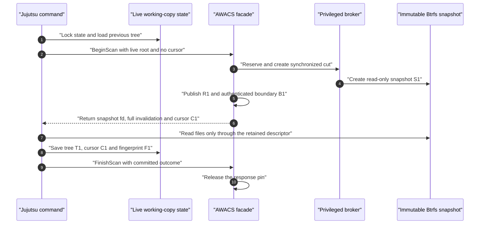

A repository has one working directory, one Jujutsu workspace, and one writer.
The user edits a file, waits for the edit to finish, runs `jj status`, and then
repeats. This is the smallest useful end-to-end example: it exposes every
ownership boundary without introducing concurrent mutations.

:::note[Two different kinds of snapshot]
A **Jujutsu snapshot** updates Jujutsu's recorded tree and working-copy state.
An **AWACS cut** creates a read-only Btrfs subvolume and publishes its indexed
filesystem state. One Jujutsu snapshot using AWACS requests one new AWACS cut.
They are related operations, not interchangeable objects.
:::

## State and ownership

Follow the same repository across these locations:

| Location | Owner | State held there |
| --- | --- | --- |
| Live workspace root | Editor and Jujutsu | Mutable checked-out files. |
| `<workspace>/.jj/working_copy` | Jujutsu | Workspace lock, checkout state, tracked file state, tree identity, and optional monitor cursor. |
| Jujutsu repository store | Jujutsu | Commit, tree, operation, and repository-view objects. |
| Managed snapshot directory outside the workspace | AWACS privileged broker | Read-only Btrfs snapshots on the same filesystem as the live root. |
| AWACS manager SQLite database | Namespace daemon | Watch identity, grants, operations, revisions, ordered cuts, monitor boundaries, leases, and snapshot pins. |
| AWACS broker receipt database | Privileged broker | Independently durable records of requested filesystem effects. |
| `watchman.sock` or `scan.sock` | Namespace daemon | The chosen compatibility or direct-scan transport. |

Use the following notation throughout the walkthrough:

```text
L        mutable live working directory
S0       initial managed immutable snapshot
Sn       immutable snapshot captured by cut n
Rn       indexed inode/reference graph for Sn
Bn       authenticated client-visible boundary for cut n
Tn       Jujutsu tree and file-state record derived from Sn
Cn       backend-tagged Jujutsu monitor cursor for Bn
Fn       fingerprint of external direct-scan inputs
```

The central direct-scan invariant is:

```text
saved Jujutsu state = (Tn, Cn, Fn)

Tn was computed from Sn
Cn authenticates Bn
Bn identifies the same Sn
Fn describes the exact external inputs used to compute Tn
```

A cursor is useful only as part of that complete tuple. Persisting a new cursor
beside an older tree, a different backend, or mismatched ignore settings makes
the next supposedly incremental scan unsafe.

### Stage-by-stage ownership ledger

| Stage | Component and function | Read root | Write location or durable record | Required invariant |
| --- | --- | --- | --- | --- |
| Workspace preparation | Jujutsu `cli_util.rs: snapshot_options_with_start_tracking_matcher` | Live workspace metadata and external configuration. | In-memory matcher and optional fingerprint. | Backend, tracking, sparse, and ignore inputs match the eventual scan. |
| First watch | AWACS `service.rs: Service::initialize` | Exact live Btrfs subvolume, then immutable `S0`. | Broker receipt, watch/grant rows, initial `R0`, snapshot pins. | `R0` describes the verified read-only `S0`, not a changing live traversal. |
| Next cut | AWACS `service.rs: Service::changes` and `finish_cut` | Live subvolume only to capture `Sn`; compare immutable prior snapshot with `Sn`. | Fenced operation, broker receipt, `watch_cuts`, comparison, indexed revision. | Per-watch cut sequence and snapshot identity remain ordered and authentic. |
| Public boundary | AWACS `facade.rs: prepare_query_after_cut` | Published indexed cut and continuity binding. | Authenticated monitor boundary and durable query lease. | The client-visible boundary identifies a validated target and still-valid namespace. |
| Direct lease | AWACS `scan_facade.rs: FacadeScanHandler::begin_scan` | Published immutable managed snapshot. | Active session and extended snapshot pin. | The returned fd, identity, cursor, and lease all describe one target. |
| Tree traversal | Jujutsu `local_working_copy.rs: TreeState::snapshot_with_pending` | `/proc/self/fd/N` for AWACS; live root for `none` or Watchman. | In-memory tree, file states, and backend-tagged cursor. | Files and in-worktree ignores come from the selected scan root. |
| Commit and release | Jujutsu `local_working_copy.rs: LockedLocalWorkingCopy::finish` | In-memory derived tree and live workspace metadata. | Live `.jj/working_copy` state first; AWACS `FinishScan` second. | Save the matching tree/cursor pair before releasing its immutable pin. |

## Step 1: Select the monitoring path

**Where:** Jujutsu `cli/src/cli_util.rs` and
`lib/src/local_working_copy.rs`.

Before scanning, Jujutsu opens the workspace, loads its working-copy state,
locks that state, constructs ignore and sparse matchers, and chooses the
configured backend.

| Backend | Tree read from | Monitor state |
| --- | --- | --- |
| `fsmonitor.backend = "none"` | Mutable live root `L`. | No monitor cursor. |
| `fsmonitor.backend = "watchman"` | Mutable live root `L`, after asking AWACS's Watchman facade which paths changed. | Watchman clock tagged as a Watchman cursor. |
| `fsmonitor.backend = "awacs"` | An open, validated, read-only AWACS snapshot descriptor. | Direct AWACS cursor plus a versioned external-input fingerprint. |

The `none` path does not require the AWACS daemon. The Watchman path retains
Jujutsu's ordinary live-tree traversal and can fall back to a full live scan if
the monitor fails. The direct AWACS path fails closed when it cannot obtain or
validate an immutable lease; silently substituting the live root would break
its consistency model.

**Invariant:** changing backend invalidates a cursor produced by the previous
backend. A Watchman clock is never a valid direct-scan cursor, and vice versa.

## Step 2: Initialize and bind the first watch

**Where:** AWACS `src/main.rs`, `src/watchman.rs`, `src/service.rs`,
`src/manager.rs`, `src/broker.rs`, and `src/namespace.rs`.

The first AWACS-backed request needs an active watch for the exact workspace
root. Depending on the transport and startup route, this happens during
namespace-daemon startup or dynamic Watchman root registration.

1. Canonicalize the requested root and confirm that it is a supported Btrfs
   subvolume root, not merely a directory somewhere inside a subvolume.
2. Identify the filesystem UUID, source subvolume UUID, requester, mount
   namespace, and visible root. Reject a managed-snapshot descendant, an
   unsupported top-level root, or another mismatched identity.
3. Reserve the watch, authorization grant, fenced operation, and a deterministic
   snapshot destination in manager SQLite.
4. Ask the separately privileged broker to create a **read-only** Btrfs
   snapshot `S0` outside the live workspace.
5. Persist the broker receipt and observed snapshot identity. Reopen `S0` and
   verify that the reopened filesystem UUID, subvolume UUID, and read-only
   status still match what was authorized.
6. Reject unsupported nested-subvolume and encryption boundaries, then build a
   complete inode/reference graph `R0` by traversing immutable `S0`.
7. Publish the initial revision, indexed-head pin, physical-head pin, active
   watch, and grant.
8. Arm root-path and mount-topology monitoring and bind the facade to that
   precise namespace view before serving client-visible clocks.

```text
Before registration

    L exists
    no watch
    no managed revision
    no client boundary

After initialization

    L exists and remains mutable
    S0 is immutable and pinned
    R0 describes S0
    watch and grant are active
    client-visible boundary has not yet been issued
```

**Invariant:** initialization sequence zero establishes the core indexed
watch. It is **not** a usable Watchman clock or direct cursor; the first
client-visible boundary requires a later synchronized cut.

For additional details, see [Watch initialization](/lifecycle/watch-initialization/)
and [Durable state and storage](/architecture/persistence/).

## Step 3: Take the first client-visible cut

**Where:** AWACS `src/facade.rs`, `src/service.rs`, `src/manager.rs`,
`src/broker.rs`, `src/manifest.rs`, and `src/index.rs`.

A first Watchman query or direct `BeginScan` cannot safely use a nonexistent
prior cursor. The facade therefore takes a fresh synchronized cut.

1. Check the namespace/root continuity monitor before creating the cut.
2. Reserve the next ordered operation and its snapshot destination in SQLite.
3. Fence the broker operation and create immutable snapshot `S1` from the live
   workspace `L`.
4. Record the broker's durable receipt and the verified identity of `S1`.
5. Compare immutable `S0` with immutable `S1` through the custom Btrfs
   changed-object interface.
6. Parse the changed-object manifest and validate reference changes, file
   metadata, hardlink aliases, surviving directory witnesses, and target
   objects.
7. Apply the validated manifest to indexed revision `R0`, publish revision `R1`,
   and mark cut 1 ready.
8. Recheck namespace continuity and create authenticated boundary `B1`, bound to
   the same watch, grant, epoch, monitor session, cut sequence, and target
   snapshot UUID.
9. Create a query lease that pins the required immutable state until the
   response is written or the direct scan finishes.

The durable filesystem-operation lifecycle is approximately:

```text
planned
    -> fs_started
    -> fs_created / uuid_recorded
    -> manifest_ready
    -> index_committed
    -> done
```

**Invariant:** a client-visible boundary may identify only a fully published,
validated indexed cut. The current implementation violates the stronger
internal ordering by moving its physical head before all target validations
finish; an invalid nested-subvolume or fscrypt snapshot can consequently wedge
the watch ([C-05](/review/p0-correctness/)).

## Step 4: Complete the initial direct Jujutsu scan

**Where:** AWACS `src/scan_facade.rs` and `src/scan.rs`; Jujutsu
`lib/src/local_working_copy.rs`.



The direct handler returns a Unix descriptor using `SCM_RIGHTS`, together with
its advertised filesystem/subvolume identity, direct cursor, invalidation, and
lease deadline.

Jujutsu validates the descriptor and scans `/proc/self/fd/<descriptor>`, not the
live workspace pathname. Because there is no prior trusted cursor, this first
response requires `Full` invalidation, subject to the existing sparse and
tracking matchers.

The traversal reads directory entries, `.gitignore` files, symlink targets,
file content, executable state, and tracked-file deletions from `S1`. The
working-copy lock and durable state writes remain under the **live** workspace's
`.jj/working_copy` directory. AWACS never writes Jujutsu's tree state.

`LockedLocalWorkingCopy::finish` then performs the critical ordering:

```text
1. Confirm the lease renewal owner is healthy.
2. Atomically save the derived tree/file state and matching direct cursor.
3. Send FinishScan(Committed).
4. Release the working-copy lock when the transaction finishes.
```

If the save fails, Jujutsu aborts the lease and does not advertise the new
cursor. If the save succeeds but the Finish response fails, the tree/cursor pair
is already durable; the remaining failure concerns daemon-side pin cleanup.

**Invariant:** the snapshot descriptor and its server-side pin outlive every
filesystem read. `PendingScan` belongs to the locked working-copy transaction,
not to a temporary traversal helper.

## Step 5: Edit a file and take the next cut

Suppose the user finishes editing `src/app.rs` after the first command returns.
The live root changes, but immutable `S1`, indexed `R1`, and Jujutsu's saved
`(T1, C1, F1)` remain unchanged until the next command.

```text
Just after editing

    L/src/app.rs              new bytes
    S1/src/app.rs             old bytes
    saved Jujutsu tree T1     old bytes
    saved AWACS cursor C1     authenticated boundary B1
```

The next `jj status` proceeds as follows:

1. Jujutsu reacquires its workspace lock and reconstructs ignores, sparsity,
   tracking settings, and external-input fingerprint `F2`.
2. If backend, fingerprint version, and external inputs still match the saved
   state, it sends direct cursor `C1`. Otherwise it discards that cursor and
   requests a fresh full scan.
3. AWACS creates immutable `S2` from the now-edited live root, compares `S1`
   with `S2`, validates changed objects, and publishes `R2` and boundary `B2`.
4. The daemon authenticates `C1` against the exact retained previous boundary,
   derives changed repository-relative paths, and returns the descriptor for
   `S2` together with cursor `C2`.
5. Jujutsu intersects the invalidated paths with its sparse matcher and unions
   explicitly force-tracked paths. It scans the selected immutable content and
   computes `T2`.
6. Jujutsu saves `(T2, C2, F2)` under the live workspace metadata directory,
   then commits the scan session.

**Expected behavior:** a single changed file requires work proportional to the
affected object and its aliases rather than a whole-repository traversal.

**Current behavior:** AWACS internally emits `src/app.rs` without a leading
slash, but `direct_invalidation` incorrectly requires `/src/app.rs`. Any real
nonempty change therefore becomes `Full`, and Jujutsu scans the entire eligible
tree ([P-03](/review/p1-performance/)). Correctness is preserved in this case;
the intended performance is not.

## Step 6: Handle renames, deletions, hardlinks, and ignore edits

Every later serial command repeats the same cut, boundary, scan, and save
protocol. The meaningful difference is which paths must be invalidated.

| Live change between cuts | Required information in the next scan |
| --- | --- |
| Add or modify `src/a.rs`. | The new repository-relative pathname and changed inode/content metadata. |
| Delete `src/a.rs`. | Its old pathname so Jujutsu removes the tracked tree entry. |
| Rename `src/a.rs` to `src/b.rs`. | Both the old and new pathname. |
| Change an inode visible through several hardlinks. | Every affected visible alias, not just the first discovered pathname. |
| Move a populated directory. | A safe old/new subtree invalidation or a conservative full scan. |
| Edit `dir/.gitignore`. | The containing subtree, because previously ignored files may become eligible. |
| Change an ignore or sparse input outside the worktree. | A different direct-scan fingerprint and a fresh full scan. |
| Replace the watched subvolume or its namespace identity. | Invalidate continuity rather than accept a reused pathname. |

**Invariant:** old paths are resolved against the old immutable graph, new paths
against the new immutable graph, and all affected hardlink references are
covered. A partial invalidation must never advance its cursor past an
unreported affected path.

External inputs are not frozen by a worktree snapshot. The direct fingerprint
therefore includes absolute Git ignore files, `info/exclude`, sparse settings,
tracking policy, size limits, conversion settings, and executable-bit policy.
The current implementation reads some ignore files once to build the matcher
and again to fingerprint them; an intervening modification can permanently
poison the baseline ([C-07](/review/p1-correctness/)).

See [External inputs and fingerprints](/integrations/external-inputs/) for the
complete input contract.

## Step 7: Run status without changing anything

Even when `L` has not changed since `S2`, the next monitored command creates
another synchronized snapshot `S3`, publishes revision/boundary 3, and obtains
a new cursor `C3`.

For a valid matching baseline, the resulting direct invalidation can contain an
empty path set. Jujutsu can then skip tree traversal while still advancing its
saved monitor cursor from `C2` to `C3`.

```text
Before clean status      (T2, C2, F2)
Immutable comparison     S2 == S3 for tracked content
After clean status       (T2, C3, F2)
```

This is safe only because the saved tree already describes the previous
authenticated snapshot and the empty invalidation proves the selected current
snapshot has no relevant changes.

The current implementation still incurs two major costs on this apparently
clean path:

- Broker snapshot creation calls filesystem-wide `syncfs`, so unrelated writes
  anywhere on the same Btrfs filesystem can delay the command
  ([P-02](/review/p0-performance/)).
- The production daemon never invokes its available history-maintenance or
  snapshot-garbage-collection routines, so these clean-command snapshots
  accumulate indefinitely ([P-01](/review/p0-performance/)).

The compatibility facade also redoes historical snapshot comparisons even when
the just-published adjacent cut already contains the needed events
([P-04](/review/p1-performance/)).

## How the same sequence differs under Watchman

With `fsmonitor.backend = "watchman"`, AWACS still initializes its watch, takes
synchronized cuts, publishes authenticated boundaries, and returns dirty paths.
However, Jujutsu receives only a clock and changed-name list. It traverses the
mutable live root instead of receiving the immutable snapshot descriptor.

```text
Watchman response       clock Bn + projected changed paths
Jujutsu file reads      live root L
Saved Jujutsu state     tree from the live crawl + Watchman-tagged clock
```

Under the serial assumption in this walkthrough, the live root does not change
between the response and traversal, so this distinction does not alter the
result. It becomes crucial once an editor runs concurrently: the next
walkthrough explains why dropping directory-dirty witnesses can then produce a
permanently false-clean working copy.

Continue with [One workspace: concurrent changes and scans](/walkthroughs/single-workspace-concurrent/).
